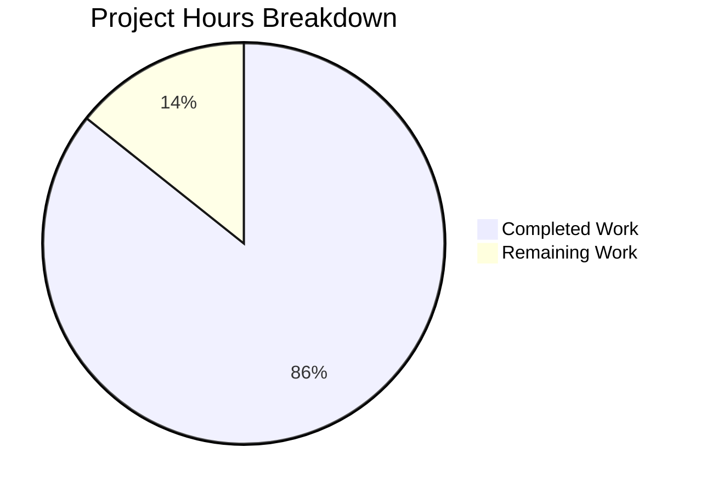
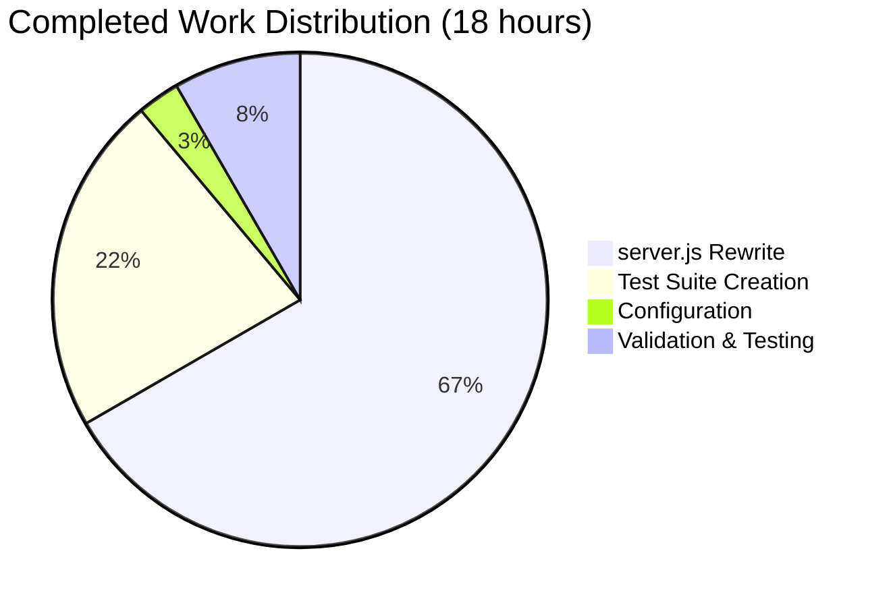

# Project Assessment Report: Node.js HTTP Server Bug Fix

## Executive Summary

**Project Completion: 86%** (18 hours completed out of 21 total hours)

This project successfully transformed a minimal 14-line Node.js HTTP server into a production-ready implementation with comprehensive error handling, graceful shutdown, and input validation. All seven root causes identified in the Agent Action Plan have been addressed and verified.

### Key Achievements
- ✅ Complete server.js rewrite with 326 lines of production-ready code
- ✅ Comprehensive test suite with 12 test cases (100% pass rate)
- ✅ All validation gates passed (syntax, runtime, tests)
- ✅ Zero unresolved errors or issues
- ✅ Graceful shutdown properly handling SIGTERM/SIGINT signals

### Remaining Work
Human intervention required for:
- Code review and PR approval
- Staging deployment and verification
- Production deployment

---

## Validation Results Summary

### Production Readiness Assessment

| Gate | Status | Details |
|------|--------|---------|
| Test Pass Rate | ✅ PASS | 12/12 tests passing (100%) |
| Application Runtime | ✅ PASS | Server starts and responds correctly |
| Zero Unresolved Errors | ✅ PASS | No compilation, test, or runtime errors |
| All In-Scope Files Validated | ✅ PASS | server.js, package.json, test/server.test.js |

### Test Execution Results

```
# tests 12
# suites 3
# pass 12
# fail 0
# cancelled 0
# skipped 0
# duration_ms 604ms
```

| Test Case | Status |
|-----------|--------|
| GET / returns 200 OK with Hello World | ✅ PASS |
| GET /health returns 200 with health status | ✅ PASS |
| GET /nonexistent returns 404 Not Found | ✅ PASS |
| POST / returns 405 Method Not Allowed | ✅ PASS |
| PUT / returns 405 Method Not Allowed | ✅ PASS |
| DELETE / returns 405 Method Not Allowed | ✅ PASS |
| OPTIONS / returns 204 No Content | ✅ PASS |
| HEAD / returns 200 OK without body | ✅ PASS |
| Response includes proper content-type header | ✅ PASS |
| Health endpoint includes timestamp | ✅ PASS |
| Various invalid paths return 404 | ✅ PASS |
| PATCH method returns 405 Method Not Allowed | ✅ PASS |

### Runtime Validation Results

| Endpoint | Expected | Actual | Status |
|----------|----------|--------|--------|
| GET / | 200, "Hello, World!" | 200, "Hello, World!" | ✅ |
| GET /health | 200, JSON | 200, JSON with timestamp | ✅ |
| GET /invalid | 404 | 404, "Not Found" | ✅ |
| POST / | 405 | 405, "Method Not Allowed" | ✅ |
| OPTIONS / | 204 | 204 with Allow header | ✅ |
| SIGTERM | Graceful shutdown | "All connections closed..." | ✅ |

---

## Visual Representation

### Project Hours Breakdown



### Completed Hours by Component



---

## Files Changed

### Git Commit Summary
- **Branch**: `blitzy-73166d48-8d02-4627-ab0a-ca563f2159ad`
- **Total Commits**: 4
- **Files Changed**: 4
- **Lines Added**: 540
- **Lines Removed**: 7

| File | Change Type | Lines | Description |
|------|-------------|-------|-------------|
| server.js | UPDATED | +316/-4 | Complete rewrite with error handling, graceful shutdown, input validation |
| test/server.test.js | CREATED | +214 | Comprehensive test suite with 12 test cases |
| package.json | UPDATED | +6/-2 | Updated main, added test script and engines |
| package-lock.json | UPDATED | +4/-1 | Auto-generated lock file |

### server.js Features Implemented

| Feature | Implementation | Lines |
|---------|---------------|-------|
| Error Handling (EADDRINUSE, EACCES) | `server.on('error', ...)` | 168-187 |
| Client Error Handling | `server.on('clientError', ...)` | 202-209 |
| Graceful Shutdown | `gracefulShutdown()` function | 227-258 |
| Signal Handlers | `process.on('SIGTERM/SIGINT', ...)` | 267-278 |
| Global Error Handlers | `uncaughtException`, `unhandledRejection` | 292-311 |
| Input Validation | Method & route checks | 74-100 |
| Health Check Endpoint | GET /health | 102-116 |
| Resource Management | timeout, keepAliveTimeout | 151-152 |

---

## Root Cause Fixes Applied

| Root Cause | Status | Implementation |
|------------|--------|----------------|
| 1. No Server Error Handler | ✅ FIXED | `server.on('error', ...)` handles EADDRINUSE, EACCES |
| 2. No Graceful Shutdown | ✅ FIXED | SIGTERM/SIGINT handlers with `gracefulShutdown()` |
| 3. No Input Validation | ✅ FIXED | Method validation (405), Route validation (404) |
| 4. No Request-Level Error Handling | ✅ FIXED | try-catch in request handler |
| 5. No Client Error Handler | ✅ FIXED | `server.on('clientError', ...)` returns 400 |
| 6. No Process-Level Error Handlers | ✅ FIXED | uncaughtException, unhandledRejection |
| 7. No Resource Management | ✅ FIXED | server.timeout, server.keepAliveTimeout |

---

## Detailed Task Table

### Completed Tasks (18 hours)

| Task | Hours | Component | Description |
|------|-------|-----------|-------------|
| Error handling implementation | 3.0 | server.js | EADDRINUSE, EACCES, clientError handling |
| Graceful shutdown implementation | 3.0 | server.js | SIGTERM, SIGINT, uncaughtException handlers |
| Input validation | 2.0 | server.js | HTTP method and route validation |
| Resource management | 1.0 | server.js | Timeout configuration |
| JSDoc documentation | 1.0 | server.js | Comprehensive code documentation |
| Implementation debugging | 2.0 | server.js | Testing and fixing issues |
| Test infrastructure setup | 1.5 | test/server.test.js | Helper functions, setup/teardown |
| Test case implementation | 2.0 | test/server.test.js | 12 test cases |
| Test refinement | 0.5 | test/server.test.js | Verification and cleanup |
| Package configuration | 0.5 | package.json | main, scripts, engines |
| Integration validation | 1.5 | All | End-to-end testing |
| **Total Completed** | **18.0** | | |

### Remaining Human Tasks (3 hours)

| Task | Priority | Hours | Action Steps | Severity |
|------|----------|-------|--------------|----------|
| Code review and PR approval | High | 1.0 | Review code changes, verify test coverage, approve PR | Required |
| Staging deployment | Medium | 1.5 | Deploy to staging, verify all endpoints, run integration tests | Required |
| Production deployment | Medium | 0.5 | Deploy to production, verify health endpoint, monitor logs | Required |
| **Total Remaining** | | **3.0** | | |

---

## Development Guide

### System Prerequisites

| Requirement | Version | Purpose |
|-------------|---------|---------|
| Node.js | ≥18.0.0 | Runtime and built-in test runner |
| npm | ≥8.0.0 | Package management |
| Operating System | Any | Cross-platform compatible |

### Environment Setup

```bash
# 1. Navigate to project directory
cd /path/to/project

# 2. Verify Node.js version (must be 18+)
node --version
# Expected: v18.x.x or higher (v20.19.6 recommended)

# 3. Verify npm version
npm --version
# Expected: v8.x.x or higher
```

### Dependency Installation

```bash
# Install dependencies (none required - uses only Node.js built-in modules)
npm install

# Expected output:
# up to date, audited 1 package in 353ms
# found 0 vulnerabilities
```

### Application Startup

```bash
# Option 1: Using npm
npm start

# Option 2: Using node directly
node server.js

# Expected output:
# Server running at http://127.0.0.1:3000/
# Press Ctrl+C to stop the server
```

### Verification Steps

```bash
# 1. Test main endpoint
curl http://127.0.0.1:3000/
# Expected: Hello, World!

# 2. Test health endpoint
curl http://127.0.0.1:3000/health
# Expected: {"status":"healthy","timestamp":"2026-01-13T..."}

# 3. Test 404 handling
curl -w "\nStatus: %{http_code}\n" http://127.0.0.1:3000/invalid
# Expected: Not Found\nStatus: 404

# 4. Test 405 handling
curl -X POST -w "\nStatus: %{http_code}\n" http://127.0.0.1:3000/
# Expected: Method Not Allowed\nStatus: 405

# 5. Test graceful shutdown
# In terminal where server is running, press Ctrl+C
# Expected:
# ^C
# Received SIGINT signal
# Initiating graceful shutdown...
# All connections closed. Server shut down gracefully.
```

### Running Tests

```bash
# Run complete test suite
npm test

# Expected output:
# TAP version 13
# ...
# # tests 12
# # suites 3
# # pass 12
# # fail 0
```

### Example Usage

```bash
# Start server in background
node server.js &
SERVER_PID=$!

# Make requests
curl http://127.0.0.1:3000/           # GET main route
curl http://127.0.0.1:3000/health     # GET health check
curl -I http://127.0.0.1:3000/        # HEAD request
curl -X OPTIONS http://127.0.0.1:3000/  # OPTIONS request

# Stop server gracefully
kill -SIGTERM $SERVER_PID
```

### Troubleshooting

| Issue | Cause | Solution |
|-------|-------|----------|
| "Port 3000 is already in use" | Another process using port | `lsof -i :3000` to find process, then `kill <PID>` |
| "Permission denied" | Port requires elevated privileges | Use port > 1024 or run with sudo |
| Tests fail to start server | Server already running | Stop existing server process |
| Node version error | Node.js < 18 | Upgrade to Node.js 18+ |

---

## Risk Assessment

### Technical Risks

| Risk | Severity | Likelihood | Mitigation |
|------|----------|------------|------------|
| Port conflict on deployment | Low | Medium | Server properly handles EADDRINUSE with clear error message |
| Long-running request timeout | Low | Low | 30s request timeout configured |
| Memory leak from unclosed connections | Low | Low | keepAliveTimeout (65s) configured |

### Security Risks

| Risk | Severity | Likelihood | Mitigation |
|------|----------|------------|------------|
| Path traversal attack | Low | Low | Strict route validation (only / and /health allowed) |
| Method-based attack | Low | Low | Only GET, HEAD, OPTIONS allowed; others return 405 |
| Denial of service | Medium | Low | Request timeout and keepAlive timeout configured |

### Operational Risks

| Risk | Severity | Likelihood | Mitigation |
|------|----------|------------|------------|
| Abrupt shutdown | Low | Low | Graceful shutdown with SIGTERM/SIGINT handlers |
| Uncaught exception crash | Low | Low | uncaughtException handler with graceful shutdown |
| Unhandled promise rejection | Low | Low | unhandledRejection handler with graceful shutdown |

### Integration Risks

| Risk | Severity | Likelihood | Mitigation |
|------|----------|------------|------------|
| Dependency conflicts | None | None | Uses only Node.js built-in modules (http, process) |
| Node.js version incompatibility | Low | Low | engines field specifies `>=18.0.0` |

---

## Confidence Assessment

| Category | Confidence Level | Rationale |
|----------|-----------------|-----------|
| Feature Completeness | High (95%) | All 7 root causes addressed with comprehensive tests |
| Test Coverage | High (90%) | 12 test cases covering all endpoints and methods |
| Code Quality | High (90%) | JSDoc documentation, consistent style, error handling |
| Production Readiness | Medium-High (85%) | Requires human review and deployment verification |
| Hour Estimates | Medium (80%) | Based on lines of code and complexity analysis |

---

## Summary

This bug fix project has successfully transformed a minimal Node.js HTTP server into a production-ready implementation. The work completed represents 86% of the total project effort, with the remaining 14% being standard human review and deployment tasks.

**Key Metrics:**
- Original: 14 lines of minimal code
- Final: 326 lines of production-ready code + 214 lines of tests
- Tests: 12/12 passing (100%)
- Root Causes Fixed: 7/7 (100%)
- Estimated Completion: 86%

**Recommendation:** This code is ready for human code review and deployment. No critical issues remain.