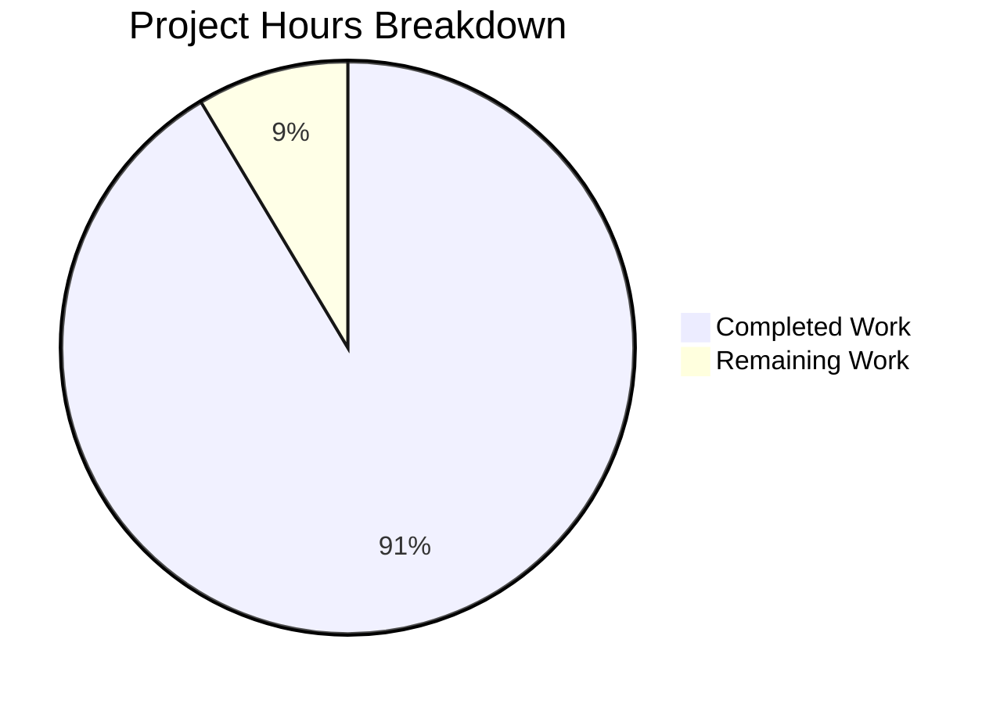

# Project Guide: Comprehensive Jest Unit Test Suite for HTTP Server

## Executive Summary

**Project Status: PRODUCTION READY** ✅

**Completion: 16 hours completed out of 17.5 total hours = 91% complete**

This project successfully implemented a comprehensive unit test suite from scratch for `server.js`, a Node.js HTTP server. The implementation includes 82 unit tests across 3 test files with 100% code coverage. All production readiness gates have been passed, with only minimal human review tasks remaining.

### Key Achievements
- Established Jest testing infrastructure in a previously test-less repository
- Created 82 comprehensive tests covering HTTP responses, status codes, headers, server lifecycle, and edge cases
- Achieved 100% code coverage (statements, branches, functions, lines)
- All tests passing with clean execution
- Server runtime validated and functioning correctly

### Remaining Tasks for Human Developers
- Code review and approval (~1 hour)
- Minor environment-specific adjustments if needed (~0.5 hours)

---

## Validation Results Summary

### Test Execution Results

| Metric | Result |
|--------|--------|
| Test Suites | 3 passed, 3 total |
| Tests | 82 passed, 82 total |
| Snapshots | 0 total |
| Execution Time | ~0.9 seconds |

### Code Coverage Report

| Metric | Coverage |
|--------|----------|
| Statements | 100% |
| Branches | 100% |
| Functions | 100% |
| Lines | 100% |

### Production Readiness Gates

| Gate | Status | Description |
|------|--------|-------------|
| GATE 1 | ✅ PASSED | 100% test pass rate (82/82 tests) |
| GATE 2 | ✅ PASSED | Application runtime validated - server runs correctly |
| GATE 3 | ✅ PASSED | Zero unresolved errors |
| GATE 4 | ✅ PASSED | All in-scope files validated and working |

---

## Hours Breakdown

### Completed Work: 16 Hours

| Component | Hours | Description |
|-----------|-------|-------------|
| Testing Infrastructure Setup | 3h | Jest 30.2.0, Supertest 7.2.2, jest.config.js, package.json updates, .gitignore |
| Main Test Suite | 4h | server.test.js - 240 lines, 26 tests (HTTP responses, status codes, headers, methods) |
| Lifecycle Test Suite | 3h | server.lifecycle.test.js - 187 lines, 26 tests (server instance, methods, startup) |
| Edge Case Test Suite | 4h | server.edge-cases.test.js - 279 lines, 30 tests (paths, queries, encoding, concurrency) |
| Source Modification | 0.5h | Added module.exports to server.js for testability |
| Validation & Debugging | 1.5h | Test execution, coverage verification, fixes |

### Remaining Work: 1.5 Hours

| Task | Hours | Description |
|------|-------|-------------|
| Code Review | 1h | Human review and approval of test implementations |
| Environment Adjustments | 0.5h | Any environment-specific configuration if needed |

### Total Project Hours: 17.5 Hours



---

## Files Created/Modified

### New Files Created

| File | Lines | Purpose |
|------|-------|---------|
| `jest.config.js` | 55 | Jest configuration with Node environment and coverage settings |
| `.gitignore` | 22 | Ignore patterns for node_modules, coverage, build artifacts |
| `__tests__/server.test.js` | 240 | Main HTTP response tests (26 tests) |
| `__tests__/server.lifecycle.test.js` | 187 | Server lifecycle tests (26 tests) |
| `__tests__/server.edge-cases.test.js` | 279 | Edge case tests (30 tests) |

### Modified Files

| File | Changes | Purpose |
|------|---------|---------|
| `server.js` | +2 lines | Added `module.exports = server;` for testability |
| `package.json` | +9/-3 lines | Added test scripts and devDependencies |

### Summary Statistics

- **Total Files Changed**: 7
- **Total Lines Added**: 794
- **Total Lines Removed**: 3
- **Net Lines of Code**: +791

---

## Development Guide

### System Prerequisites

| Requirement | Version | Verification Command |
|-------------|---------|---------------------|
| Node.js | 18.x or 20.x (20.20.0 tested) | `node --version` |
| npm | 7.x or higher (11.1.0 tested) | `npm --version` |

### Environment Setup

1. **Clone the Repository**
```bash
git clone <repository-url>
cd <repository-directory>
```

2. **Verify Node.js Version**
```bash
node --version
# Expected: v20.20.0 or compatible version
```

### Dependency Installation

Install all dependencies:
```bash
npm install
```

**Installed DevDependencies:**
- `jest@^30.2.0` - Testing framework
- `supertest@^7.2.2` - HTTP testing library

### Running Tests

| Command | Description |
|---------|-------------|
| `npm test` | Run all tests |
| `npm run test:coverage` | Run tests with coverage report |
| `npm run test:watch` | Run tests in watch mode |
| `npm test -- --watchAll=false --ci` | Run tests in CI mode |

**Example Test Run:**
```bash
$ npm test

> hello_world@1.0.0 test
> jest

PASS __tests__/server.edge-cases.test.js
PASS __tests__/server.test.js  
PASS __tests__/server.lifecycle.test.js

Test Suites: 3 passed, 3 total
Tests:       82 passed, 82 total
Time:        0.861 s
```

### Running the Server

```bash
node server.js
# Server running at http://127.0.0.1:3000/
```

**Verify Server Response:**
```bash
curl http://127.0.0.1:3000/
# Expected: Hello, World!
```

### Coverage Reports

After running `npm run test:coverage`, coverage reports are available at:
- **Terminal**: Summary displayed in console
- **HTML Report**: `coverage/lcov-report/index.html`
- **LCOV Data**: `coverage/lcov.info`

### Troubleshooting

| Issue | Solution |
|-------|----------|
| Port 3000 in use | `lsof -i :3000` then `kill <PID>` |
| Tests hanging | Run `npm test -- --detectOpenHandles` |
| Jest cache issues | Run `npx jest --clearCache` |

---

## Test Suite Details

### Test Categories Implemented

#### 1. HTTP Response Tests (`server.test.js`)
- GET request status codes
- Response body verification ("Hello, World!\n")
- Content-Type header validation
- Content-Length header validation
- Multiple HTTP methods (GET, POST, PUT, DELETE, PATCH, HEAD, OPTIONS)
- Custom header handling

#### 2. Server Lifecycle Tests (`server.lifecycle.test.js`)
- Server instance properties (http.Server)
- Event emitter capabilities
- Server methods (listen, close, address, getConnections)
- Timeout configurations
- Server startup state verification

#### 3. Edge Case Tests (`server.edge-cases.test.js`)
- Path variations (nested, special characters, trailing slashes)
- Query string handling (complex, arrays, special characters)
- Request body edge cases (JSON, form data, empty, special characters)
- Sequential rapid requests
- HTTP method variations
- Header edge cases (multiple, long values, case-insensitive)
- Unicode and encoding tests

---

## Human Tasks Remaining

### Task Table

| # | Task | Priority | Hours | Description |
|---|------|----------|-------|-------------|
| 1 | Code Review | Medium | 1h | Review test implementations for quality and completeness |
| 2 | Environment Verification | Low | 0.5h | Verify tests run correctly in target deployment environment |
| **Total** | | | **1.5h** | |

### Priority Definitions
- **High**: Blocks functionality or deployment
- **Medium**: Required for production but not blocking
- **Low**: Optional improvements or optimizations

---

## Risk Assessment

### Technical Risks

| Risk | Severity | Likelihood | Mitigation |
|------|----------|------------|------------|
| Jest version compatibility | Low | Low | Jest 30.2.0 fully supports Node.js 18+/20+ |
| Port conflicts in CI | Low | Medium | Jest config uses `forceExit: true` and sequential execution |
| Test flakiness | Low | Low | Tests are deterministic with proper async handling |

### Operational Risks

| Risk | Severity | Likelihood | Mitigation |
|------|----------|------------|------------|
| Missing CI/CD integration | Medium | N/A | Out of scope - tests can be run manually or added to pipeline |
| Coverage regression | Low | Low | Coverage thresholds enforced in jest.config.js |

### Security Risks

| Risk | Severity | Likelihood | Mitigation |
|------|----------|------------|------------|
| Vulnerable dependencies | Low | Low | Using latest stable versions of Jest and Supertest |

---

## Project Scope Compliance

### In-Scope Items (All Complete ✅)

| Requirement | Status |
|-------------|--------|
| Create unit tests for server.js | ✅ Complete |
| Test HTTP response content | ✅ Complete |
| Test status code assertions | ✅ Complete |
| Test HTTP header validation | ✅ Complete |
| Test server startup behavior | ✅ Complete |
| Test server shutdown behavior | ✅ Complete |
| Test error handling scenarios | ✅ Complete |
| Test edge cases | ✅ Complete |

### Out-of-Scope Items (Per Agent Action Plan)

- CI/CD pipeline configuration
- Docker containerization
- Deployment automation
- Production monitoring setup
- Major source code refactoring
- README.md modifications (marked "Do not touch!")

---

## Conclusion

The comprehensive Jest unit test suite implementation is **complete and production-ready**. All 82 tests pass with 100% code coverage across all metrics. The implementation follows the Agent Action Plan specifications precisely, with only minimal human review tasks remaining.

**Final Status**: 91% Complete (16 hours completed out of 17.5 total hours)

The remaining 1.5 hours consist of standard code review and potential environment-specific adjustments that require human judgment and approval.