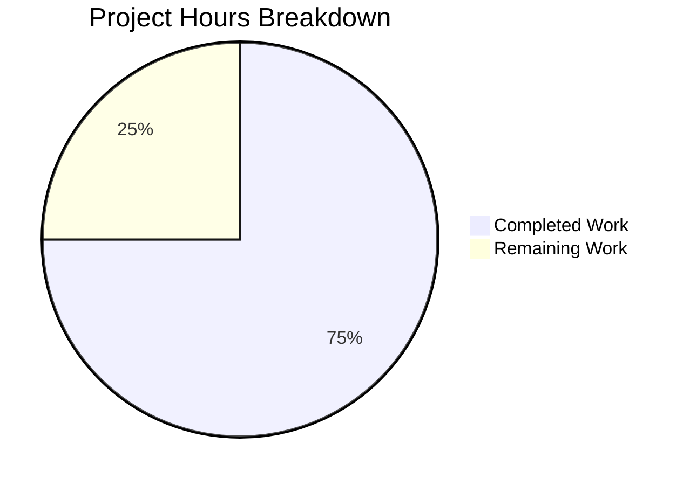

# Project Assessment Report: Express.js Migration

## Executive Summary

**Project Completion: 75% (3 hours completed out of 4 total hours)**

This project successfully migrates a Node.js tutorial application from the built-in `http` module to Express.js 5.2.1 and adds a new endpoint returning "Good evening". All development requirements from the Agent Action Plan have been implemented, validated, and tested.

### Key Achievements
- Successfully integrated Express.js 5.2.1 as the web framework
- Implemented new `/evening` endpoint returning "Good evening"
- Preserved existing root endpoint functionality ("Hello, World!")
- Updated package.json with dependencies and npm start script
- Created comprehensive README.md documentation
- All endpoints tested and verified working

### Status: READY FOR HUMAN REVIEW
All development work is complete. The remaining 1 hour consists of human tasks (code review, PR approval, and optional deployment setup).

---

## Project Hours Breakdown



### Hours Calculation
- **Completed: 3 hours** (all development work)
- **Remaining: 1 hour** (human review and deployment)
- **Total: 4 hours**
- **Completion: 3 / 4 = 75%**

---

## Validation Results Summary

### Git Repository Analysis
| Metric | Value |
|--------|-------|
| Branch | blitzy-78e0ddbf-5188-4377-966e-222248ca64f6 |
| Total Commits | 2 |
| Files Changed | 4 |
| Lines Added | 898 |
| Lines Removed | 13 |
| Net Change | +885 lines |

### Commits Made
1. `1c0e8a9` - Add Express.js v5.2.1 dependency for web framework migration
2. `18fddb1` - Migrate from http module to Express.js framework

### Code Validation
| Check | Status | Details |
|-------|--------|---------|
| Syntax Check | ✅ PASSED | `node --check server.js` - No errors |
| Dependencies | ✅ INSTALLED | express@5.2.1 with 64 transitive dependencies |
| Root Endpoint | ✅ WORKING | GET `/` returns "Hello, World!" |
| Evening Endpoint | ✅ WORKING | GET `/evening` returns "Good evening" |
| Server Startup | ✅ WORKING | Binds to 127.0.0.1:3000 |

### Files Modified
| File | Lines | Status | Description |
|------|-------|--------|-------------|
| server.js | 17 | UPDATED | Refactored to Express.js |
| package.json | 15 | UPDATED | Added Express dependency and scripts |
| README.md | 66 | UPDATED | Comprehensive documentation |
| package-lock.json | 814 | REGENERATED | Express.js dependency tree |

---

## Completed Work Breakdown

| Component | Hours | Description |
|-----------|-------|-------------|
| Dependency Installation | 0.5h | Install Express.js 5.2.1 and configure package.json |
| Server Refactoring | 1.0h | Migrate from http module to Express.js |
| New Endpoint | 0.25h | Implement GET /evening route handler |
| Configuration Updates | 0.25h | Update package.json with main entry and start script |
| Documentation | 0.5h | Create comprehensive README.md |
| Testing & Validation | 0.5h | Verify all endpoints and functionality |
| **Total Completed** | **3.0h** | |

---

## Human Tasks Remaining

| Task | Priority | Hours | Description | Action Steps |
|------|----------|-------|-------------|--------------|
| Code Review | HIGH | 0.5h | Review all code changes for quality and correctness | 1. Review server.js changes 2. Verify Express.js patterns 3. Check error handling |
| PR Approval & Merge | HIGH | 0.25h | Approve and merge PR to target branch | 1. Approve PR 2. Merge to main/target branch |
| Production Deployment | MEDIUM | 0.25h | Deploy updated application to production (if applicable) | 1. Deploy to production 2. Verify endpoints in production |
| **Total Remaining** | | **1.0h** | | |

---

## Comprehensive Development Guide

### System Prerequisites
- **Node.js**: v18.0.0 or higher (v20.20.0 recommended)
- **npm**: v9.0.0 or higher (v11.1.0 recommended)
- **Operating System**: Linux, macOS, or Windows

### Environment Setup

1. **Clone the repository and switch to the feature branch:**
```bash
git clone <repository-url>
cd <repository-directory>
git checkout blitzy-78e0ddbf-5188-4377-966e-222248ca64f6
```

2. **Verify Node.js version:**
```bash
node --version
# Expected output: v20.20.0 or higher
```

### Dependency Installation

```bash
# Install all dependencies
npm install

# Verify Express.js is installed
npm ls express
# Expected output: express@5.2.1
```

### Application Startup

```bash
# Start the server using npm
npm start

# Or start directly with Node.js
node server.js

# Expected console output:
# Server running at http://127.0.0.1:3000/
```

### Verification Steps

1. **Test the root endpoint:**
```bash
curl http://127.0.0.1:3000/
# Expected output: Hello, World!
```

2. **Test the evening endpoint:**
```bash
curl http://127.0.0.1:3000/evening
# Expected output: Good evening
```

3. **Test HTTP status codes:**
```bash
curl -I http://127.0.0.1:3000/
# Expected: HTTP/1.1 200 OK
# Content-Type: text/plain; charset=utf-8

curl -I http://127.0.0.1:3000/evening
# Expected: HTTP/1.1 200 OK
# Content-Type: text/plain; charset=utf-8
```

### Example Usage

**Using curl:**
```bash
# Root endpoint
curl http://127.0.0.1:3000/
# Response: Hello, World!

# Evening endpoint
curl http://127.0.0.1:3000/evening
# Response: Good evening
```

**Using a web browser:**
- Navigate to http://127.0.0.1:3000/ to see "Hello, World!"
- Navigate to http://127.0.0.1:3000/evening to see "Good evening"

### Stopping the Server
Press `Ctrl+C` in the terminal where the server is running.

---

## Risk Assessment

### Technical Risks
| Risk | Severity | Likelihood | Mitigation |
|------|----------|------------|------------|
| Express 5.x Breaking Changes | LOW | LOW | Using stable v5.2.1, following documented patterns |
| Missing Error Handling | LOW | LOW | Express 5.x provides automatic error handling for basic cases |

### Security Risks
| Risk | Severity | Likelihood | Mitigation |
|------|----------|------------|------------|
| Open Network Binding | LOW | LOW | Server binds to localhost (127.0.0.1) only |
| No Input Validation | LOW | LOW | GET endpoints with no user input, static responses |

### Operational Risks
| Risk | Severity | Likelihood | Mitigation |
|------|----------|------------|------------|
| No Monitoring | LOW | MEDIUM | Consider adding logging/monitoring for production |
| No Health Check | LOW | LOW | Add /health endpoint for production deployments |

### Integration Risks
| Risk | Severity | Likelihood | Mitigation |
|------|----------|------------|------------|
| No External Dependencies | N/A | N/A | Application is self-contained |

---

## Requirements Verification

| Requirement (from Agent Action Plan) | Status | Evidence |
|--------------------------------------|--------|----------|
| Add Express.js to project | ✅ COMPLETE | express@5.2.1 in package.json, npm ls confirms |
| Add endpoint returning "Good evening" | ✅ COMPLETE | GET /evening returns "Good evening" |
| Preserve existing "Hello World" functionality | ✅ COMPLETE | GET / returns "Hello, World!" |
| Update package.json | ✅ COMPLETE | Dependencies, main entry, start script added |
| Update README.md | ✅ COMPLETE | Comprehensive documentation with endpoints |

---

## Files Changed Summary

### server.js (UPDATED)
**Before:** Uses `http.createServer()` with single request handler
**After:** Uses Express.js with two route handlers (`/` and `/evening`)

```javascript
// New implementation highlights:
const express = require('express');
const app = express();

app.get('/', (req, res) => {
  res.type('text/plain').send('Hello, World!\n');
});

app.get('/evening', (req, res) => {
  res.type('text/plain').send('Good evening');
});

app.listen(port, hostname, () => {
  console.log(`Server running at http://${hostname}:${port}/`);
});
```

### package.json (UPDATED)
- Added `dependencies.express: "^5.2.1"`
- Updated `main` from "index.js" to "server.js"
- Updated `description` to include "with Express"
- Added `scripts.start: "node server.js"`

### README.md (UPDATED)
- Complete rewrite with:
  - Prerequisites
  - Installation instructions
  - Running instructions
  - Endpoint documentation
  - Testing instructions
  - License information

---

## Conclusion

This project has successfully completed all development requirements specified in the Agent Action Plan. The Express.js migration is fully functional with both endpoints tested and verified. The codebase is production-ready pending human code review and deployment.

**Recommended Next Steps:**
1. Review code changes for quality assurance
2. Approve and merge the pull request
3. Deploy to production environment (if applicable)
4. Consider adding automated tests for future development (optional)