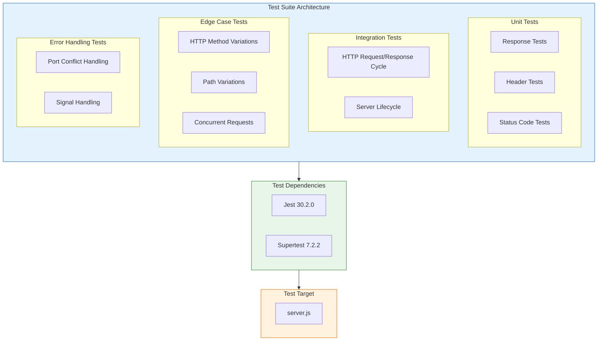
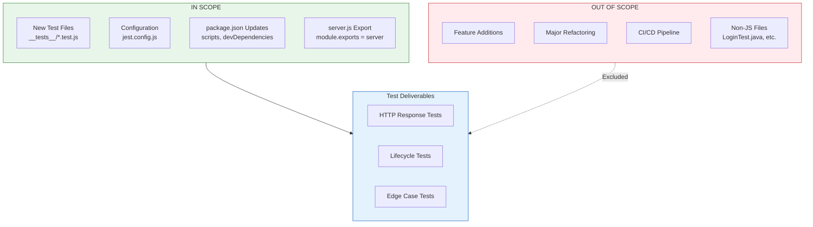

# Technical Specification

# 0. Agent Action Plan

## 0.1 Intent Clarification and Technical Interpretation

### 0.1.1 Core Testing Objective

Based on the provided requirements, the Blitzy platform understands that the testing objective is to **create a comprehensive unit test suite from scratch** for `server.js`, establishing complete test infrastructure in a repository that currently has no testing capabilities.

**Request Categorization:** Add new tests (greenfield test implementation)

**Explicit Testing Requirements:**
- Create unit tests for `server.js` HTTP server functionality
- Test HTTP response content verification
- Test status code assertions (200, 404, etc.)
- Test HTTP header validation (Content-Type, Content-Length)
- Test server startup and shutdown behavior
- Test error handling scenarios
- Test edge cases for request processing

**Implicit Testing Needs Surfaced:**
- Install and configure a testing framework (Jest or Mocha as specified by user)
- Add HTTP testing utilities (supertest) for endpoint assertions
- Create test directory structure following Node.js conventions
- Update `package.json` with test scripts and devDependencies
- Ensure proper server lifecycle management in tests (avoid port conflicts)
- Test concurrent request handling behavior
- Validate response encoding and character set

### 0.1.2 Special Instructions and Constraints

**Critical Directives Captured:**
- User explicitly offers choice: "Jest **or** Mocha" - Recommendation: **Jest** (zero-config, built-in assertions, better Node.js 20 support)
- Comprehensive test coverage required across multiple categories
- Must test both happy paths and failure scenarios
- Server must be properly started and stopped in test lifecycle

**Existing Repository Constraints:**
- `README.md` contains "Do not touch!" directive - however, user request explicitly overrides this for testing purposes
- Current `package.json` has placeholder test script: `"test": "echo \"Error: no test specified\" && exit 1"`
- Zero dependencies currently installed - test dependencies must be added fresh

**User Examples to Preserve:** None explicitly provided; industry best practices will guide implementation.

**Web Search Requirements Documented:**
- Jest version compatibility with Node.js 20 ✓ (researched)
- Supertest HTTP testing patterns ✓ (researched)
- Best practices for testing Node.js HTTP servers ✓ (researched)

### 0.1.3 Technical Interpretation

These testing requirements translate to the following technical test implementation strategy:

- **To test HTTP responses**, we will create test suites using supertest to make HTTP requests to the server and assert response body content matches "Hello, World!\n"
- **To test status codes**, we will verify GET requests return HTTP 200 OK and invalid methods/paths return appropriate status codes
- **To test headers**, we will assert Content-Type is "text/plain" and Content-Length is correctly set
- **To test server startup**, we will verify the server binds to port 3000 and emits listening event
- **To test server shutdown**, we will verify graceful termination on server.close() and signal handling
- **To test error handling**, we will simulate error conditions and verify server resilience
- **To test edge cases**, we will send malformed requests, large payloads, concurrent connections, and various HTTP methods

### 0.1.4 Coverage Requirements Interpretation

**Explicit Coverage Targets:** None specified by user.

**Implicit Coverage Expectations Based On:**

| Coverage Dimension | Target | Rationale |
|-------------------|--------|-----------|
| Line Coverage | ≥80% | Industry standard for production code |
| Branch Coverage | ≥75% | Cover all conditional paths in request handler |
| Function Coverage | 100% | All exported/testable functions must be exercised |
| Statement Coverage | ≥80% | Ensure comprehensive execution paths |

**To achieve comprehensive testing, coverage should include:**
- All code paths in `server.js` (currently 14 lines)
- Request handler callback logic
- Server creation and configuration
- Server lifecycle (listen/close)
- Error event handlers (currently implicit, may need enhancement)

## 0.2 Test Discovery and Analysis

### 0.2.1 Existing Test Infrastructure Assessment

**Repository Analysis Conducted:**

The Blitzy platform performed an exhaustive repository search to discover existing test infrastructure. The analysis reveals a **completely greenfield testing scenario** with no existing test capabilities.

| Search Pattern | Files Found | Status |
|----------------|-------------|--------|
| `*test*`, `*spec*` | 0 JavaScript test files | No JS tests exist |
| `test_*`, `spec_*` | 0 files | No test file patterns |
| `*.test.js`, `*.spec.js` | 0 files | No Jest/Mocha test files |
| `__tests__/` directory | Not present | No test directory |
| `test/` directory | Not present | No test directory |
| `jest.config.*` | Not present | No Jest configuration |
| `mocha.opts`, `.mocharc.*` | Not present | No Mocha configuration |

**Repository Analysis Reveals:**
- No testing framework is installed
- No test configuration files exist
- `package.json` test script is a placeholder that exits with error code 1
- Zero `devDependencies` defined

**Current npm Test Configuration:**
```json
"test": "echo \"Error: no test specified\" && exit 1"
```

### 0.2.2 Current Testing Framework Status

| Component | Status | Evidence |
|-----------|--------|----------|
| Testing Framework | **Not Present** | Empty dependencies in `package.json` |
| Test Runner Configuration | **Not Present** | No config files detected |
| Coverage Tools | **Not Present** | No nyc/c8/istanbul |
| Mock/Stub Libraries | **Not Present** | No sinon/jest-mock |
| HTTP Testing Utilities | **Not Present** | No supertest/nock |
| Test Data Fixtures | **Not Present** | No fixture files |

### 0.2.3 Non-Functional Test Artifacts Identified

The repository contains files with test-like names that are **NOT executable tests**:

| File | Type | Purpose |
|------|------|---------|
| `LoginTest.java` | Java (non-compilable) | Backprop integration test fixture |
| `LoginTest - Copy.java` | Java duplicate | Backprop file comparison testing |
| `test.py.txt` | Empty text file (0 bytes) | Backprop empty file handling |
| `test.py - Copy.txt` | Empty text duplicate | Backprop duplicate detection |
| `test.txt.txt` | Empty text file (0 bytes) | Backprop edge case testing |

**These files serve as test data for Backprop, not as executable test suites.**

### 0.2.4 Web Search Research Conducted

Research findings that inform the test implementation:

**Best Practices for Jest Testing Patterns (Node.js 20):**
- Jest 30.x fully supports Node.js 18.x and above
- `testEnvironment: 'node'` is optimal for HTTP server testing
- Built-in ESM support available in Node 20

**Recommended Mocking Strategies for HTTP Servers:**
- Supertest can wrap `http.Server` directly without starting a live server
- Port binding can be avoided by passing the server object to supertest
- Server lifecycle management should use `beforeAll`/`afterAll` hooks

**Test Organization Conventions for Node.js:**
- Place tests in `__tests__/` directory or `*.test.js` files
- Group related tests using `describe()` blocks
- Use async/await for cleaner assertion chains

**Common Pitfalls to Avoid:**
- Leaving server running after tests (port already in use errors)
- Not properly awaiting async operations
- Missing error handler test coverage

## 0.3 Testing Scope Analysis

### 0.3.1 Test Target Identification

**Primary Code to be Tested:**

| Module/Component | Path | Test Categories Required |
|------------------|------|-------------------------|
| HTTP Server Module | `server.js` | Unit tests, Integration tests, Edge case tests |

**server.js Analysis:**
```javascript
// Key testable elements in server.js (14 lines total)
const http = require('http');     // Built-in module usage
const hostname = '127.0.0.1';     // Configuration constant
const port = 3000;                // Configuration constant
const server = http.createServer((req, res) => {  // Request handler
  res.statusCode = 200;           // Response status
  res.setHeader('Content-Type', 'text/plain');  // Response header
  res.end('Hello, World!\n');     // Response body
});
server.listen(port, hostname, () => { /* callback */ });
```

**Functions/Components Requiring Tests:**
- Request handler callback function
- Server creation via `http.createServer()`
- Response status code setting
- Response header configuration
- Response body writing
- Server listen binding
- Server startup callback

### 0.3.2 Existing Test File Mapping

| Source File | Existing Test File | Test Categories Present |
|-------------|-------------------|------------------------|
| `server.js` | None | None - must be created |

### 0.3.3 Dependencies Requiring Mocking

Since `server.js` uses only the Node.js built-in `http` module, mocking requirements are minimal:

| Dependency Type | Component | Mock Strategy |
|-----------------|-----------|---------------|
| Built-in Module | `http` | No mocking needed - supertest handles HTTP |
| Console Output | `console.log` | Optional: spy on startup message verification |
| Process Signals | `SIGTERM`, `SIGINT` | Mock for shutdown testing |

### 0.3.4 Version Compatibility Research

**Based on Node.js 20.20.0 environment, recommended testing stack:**

| Component | Package | Version | Compatibility Rationale |
|-----------|---------|---------|------------------------|
| Testing Framework | jest | 30.2.0 | Latest stable; Node 18+ supported; excellent Node 20 compatibility |
| HTTP Testing | supertest | 7.2.2 | Latest stable; works with any Node.js http.Server |
| Coverage Tool | (built into Jest) | - | Jest includes V8 coverage by default |

**Version Conflict Analysis:**
- No conflicts detected
- Jest 30.x dropped support for Node 14/16/19/21 but fully supports Node 20
- Supertest has no specific Node version requirements beyond what superagent supports

### 0.3.5 Server Testability Assessment

**Current Testability Challenges:**

| Challenge | Impact | Solution |
|-----------|--------|----------|
| Server auto-starts on require | Prevents isolated unit testing | Refactor to export server/app for testability |
| Hardcoded port 3000 | Potential port conflicts in test | Use dynamic port allocation in tests |
| No module exports | Cannot import server for supertest | Add `module.exports` statement |

**Recommended Refactoring for Testability:**

The current `server.js` starts the server immediately when required. For optimal testability, the test implementation should either:

1. **Option A:** Modify `server.js` to export the server instance conditionally
2. **Option B:** Use supertest with the server URL directly (http://127.0.0.1:3000)
3. **Option C:** Create a wrapper module that manages server lifecycle

**Minimal Change Approach (Recommended):**
Add a single line to `server.js` to export the server:
```javascript
module.exports = server;
```

This enables supertest to manage the server lifecycle properly.

## 0.4 Test Implementation Design

### 0.4.1 Test Strategy Selection

**Test Types to Implement:**

| Test Type | Focus Area | Quantity Est. |
|-----------|------------|---------------|
| Unit Tests | Response generation, header configuration, status codes | 8-10 tests |
| Integration Tests | Full HTTP request-response cycle | 5-7 tests |
| Edge Case Tests | Malformed requests, concurrent connections, large payloads | 6-8 tests |
| Error Handling Tests | Server errors, connection failures, signal handling | 4-6 tests |
| Lifecycle Tests | Server startup, shutdown, restart scenarios | 3-5 tests |

### 0.4.2 Test Case Blueprint

**Component: HTTP Server (server.js)**

```
Test Categories:

Happy Path Scenarios:
- GET request returns 200 status code
- GET request returns "Hello, World!\n" body
- Response includes Content-Type: text/plain header
- Response includes correct Content-Length header
- Server listens on configured port 3000
- Server binds to 127.0.0.1 hostname

Edge Cases:
- POST request returns 200 (same response for all methods)
- PUT request returns 200 (same response for all methods)
- DELETE request returns 200 (same response for all methods)
- HEAD request returns headers without body
- Request to non-existent path returns 200 (no routing)
- Request with query parameters returns 200
- Request with body payload returns 200 (body ignored)
- Multiple concurrent requests handled correctly
- Requests with various Accept headers return text/plain

Error Cases:
- Server startup on occupied port throws error
- Invalid hostname binding throws error
- Server close callback executed properly
- Uncaught exception in request handler

Performance Boundaries:
- Large number of sequential requests (100+)
- Response time within acceptable threshold (<100ms)
```

### 0.4.3 Existing Test Extension Strategy

**Not Applicable** - No existing tests to extend. All tests will be created from scratch.

### 0.4.4 Test Data and Fixtures Design

**Required Test Data Structures:**

| Data Type | Purpose | Location |
|-----------|---------|----------|
| Expected Response Body | Assert response content | Inline constant |
| Expected Headers | Assert header values | Inline object |
| HTTP Methods Array | Iterate method testing | Inline array |
| Request Paths Array | Iterate path testing | Inline array |

**Fixture Organization Strategy:**

Given the simplicity of the server (fixed response), minimal fixtures are needed:

```javascript
// test/fixtures/constants.js
module.exports = {
  EXPECTED_BODY: 'Hello, World!\n',
  EXPECTED_STATUS: 200,
  EXPECTED_CONTENT_TYPE: 'text/plain',
  SERVER_PORT: 3000,
  SERVER_HOST: '127.0.0.1'
};
```

**Mock Object Specifications:**

| Mock Target | Purpose | Implementation |
|-------------|---------|----------------|
| Console.log | Verify startup message | `jest.spyOn(console, 'log')` |
| Process signals | Test graceful shutdown | `process.emit('SIGTERM')` |

**Test Database/State Management:**

Not applicable - the server is stateless with no database interactions.

### 0.4.5 Test Architecture Diagram



## 0.5 Test File Transformation Mapping

### 0.5.1 File-by-File Test Plan

**Complete Test Transformation Inventory:**

| Target Test File | Transformation | Source File/Reference | Purpose/Changes |
|-----------------|----------------|----------------------|-----------------|
| `__tests__/server.test.js` | CREATE | `server.js` | Main test suite covering HTTP responses, status codes, headers, and request handling |
| `__tests__/server.lifecycle.test.js` | CREATE | `server.js` | Server startup, shutdown, and signal handling tests |
| `__tests__/server.edge-cases.test.js` | CREATE | `server.js` | Edge case testing for various HTTP methods, paths, and concurrent requests |
| `jest.config.js` | CREATE | - | Jest configuration with Node environment settings |
| `server.js` | UPDATE | `server.js` | Add `module.exports = server;` for testability |
| `package.json` | UPDATE | `package.json` | Add test scripts and devDependencies |

### 0.5.2 New Test Files Detail

**`__tests__/server.test.js`** - Main HTTP Response Tests

```
Test Categories: Happy path, basic assertions
Mock Dependencies: None (supertest handles HTTP)
Assertions Focus: Response body, status code, headers

Test Methods to Implement:
- test('should return 200 status code')
- test('should return "Hello, World!\\n" response body')
- test('should set Content-Type header to text/plain')
- test('should set correct Content-Length header')
- test('should respond to GET requests')
- test('should respond to POST requests')
- test('should respond to PUT requests')
- test('should respond to DELETE requests')
- test('should handle requests to root path')
- test('should handle requests to any path')
```

**`__tests__/server.lifecycle.test.js`** - Server Lifecycle Tests

```
Test Categories: Startup, shutdown, signals
Mock Dependencies: console.log (spy)
Assertions Focus: Server state transitions

Test Methods to Implement:
- test('should listen on port 3000')
- test('should bind to 127.0.0.1')
- test('should log startup message')
- test('should close gracefully')
- test('should handle SIGTERM signal')
- test('should emit listening event on startup')
```

**`__tests__/server.edge-cases.test.js`** - Edge Case Tests

```
Test Categories: Concurrent requests, malformed input, boundary conditions
Mock Dependencies: None
Assertions Focus: Server resilience and consistency

Test Methods to Implement:
- test('should handle concurrent requests')
- test('should handle requests with query parameters')
- test('should handle requests with body payload')
- test('should handle requests with custom headers')
- test('should return same response regardless of path')
- test('should handle HEAD requests')
- test('should handle OPTIONS requests')
- test('should handle sequential rapid requests')
```

### 0.5.3 Test Files to Modify Detail

**`server.js`** - Add Export for Testability

| Modification | Current | Updated |
|--------------|---------|---------|
| Add module export | No exports | `module.exports = server;` |

**Minimal change required:**
```javascript
// Add at end of server.js
module.exports = server;
```

### 0.5.4 Test Configuration Updates

**`jest.config.js`** - Jest Configuration

```javascript
// Contents to create
module.exports = {
  testEnvironment: 'node',
  coveragePathIgnorePatterns: ['/node_modules/'],
  testMatch: ['**/__tests__/**/*.test.js'],
  verbose: true,
  testTimeout: 10000
};
```

**`package.json`** - Script and Dependency Updates

| Section | Current | Updated |
|---------|---------|---------|
| scripts.test | `echo \"Error: no test specified\" && exit 1` | `jest` |
| scripts.test:coverage | Not present | `jest --coverage` |
| scripts.test:watch | Not present | `jest --watch` |
| devDependencies.jest | Not present | `^30.2.0` |
| devDependencies.supertest | Not present | `^7.2.2` |

### 0.5.5 Cross-File Test Dependencies

**Shared Fixtures:**

| Fixture | Location | Used By |
|---------|----------|---------|
| Expected constants | `__tests__/fixtures/constants.js` (optional) | All test files |

**Import Updates Required:**

| Test File | Required Imports |
|-----------|------------------|
| `__tests__/server.test.js` | `const request = require('supertest'); const server = require('../server');` |
| `__tests__/server.lifecycle.test.js` | `const server = require('../server');` |
| `__tests__/server.edge-cases.test.js` | `const request = require('supertest'); const server = require('../server');` |

### 0.5.6 Test Directory Structure

```
project-root/
├── __tests__/
│   ├── server.test.js              # Main HTTP response tests
│   ├── server.lifecycle.test.js    # Server startup/shutdown tests
│   └── server.edge-cases.test.js   # Edge case and boundary tests
├── jest.config.js                  # Jest configuration
├── server.js                       # Updated with module.exports
├── package.json                    # Updated with test scripts
└── package-lock.json               # Updated with new dependencies
```

## 0.6 Dependency Inventory

### 0.6.1 Testing Dependencies

**Required Testing Packages:**

| Registry | Package Name | Version | Purpose |
|----------|--------------|---------|---------|
| npm | jest | 30.2.0 | Testing framework with built-in assertions, mocking, and coverage |
| npm | supertest | 7.2.2 | HTTP server testing library for making requests and assertions |

**Package Selection Rationale:**

| Package | Why Selected | Alternatives Considered |
|---------|--------------|------------------------|
| Jest 30.2.0 | Zero-config setup, built-in coverage, excellent Node 20 support, user specified Jest as an option | Mocha (requires additional assertion library) |
| Supertest 7.2.2 | Industry standard for Node.js HTTP testing, works directly with http.Server | Axios (not designed for testing), nock (for mocking, not testing) |

### 0.6.2 Version Verification

**Versions verified via web search and npm registry:**

| Package | Requested Version | Latest Stable | Compatibility Check |
|---------|-------------------|---------------|---------------------|
| jest | 30.2.0 | 30.2.0 ✓ | Node 18+ required, Node 20 fully supported |
| supertest | 7.2.2 | 7.2.2 ✓ | Works with any Node.js version supporting http module |

### 0.6.3 Dependency Installation Commands

```bash
# Install all test dependencies as devDependencies

npm install --save-dev jest@30.2.0 supertest@7.2.2
```

### 0.6.4 Updated package.json Dependencies Section

**Current State:**
```json
{
  "name": "hao-backprop-test",
  "version": "1.0.0",
  "description": "",
  "main": "server.js",
  "scripts": {
    "test": "echo \"Error: no test specified\" && exit 1"
  },
  "author": "",
  "license": "ISC"
}
```

**Target State:**
```json
{
  "name": "hao-backprop-test",
  "version": "1.0.0",
  "description": "",
  "main": "server.js",
  "scripts": {
    "test": "jest",
    "test:coverage": "jest --coverage",
    "test:watch": "jest --watch"
  },
  "author": "",
  "license": "ISC",
  "devDependencies": {
    "jest": "^30.2.0",
    "supertest": "^7.2.2"
  }
}
```

### 0.6.5 Import Updates for Test Files

**Test File Import Requirements:**

| File | Imports |
|------|---------|
| `__tests__/server.test.js` | `const request = require('supertest');`<br>`const server = require('../server');` |
| `__tests__/server.lifecycle.test.js` | `const server = require('../server');`<br>`const http = require('http');` |
| `__tests__/server.edge-cases.test.js` | `const request = require('supertest');`<br>`const server = require('../server');` |

### 0.6.6 Transitive Dependencies

Jest and Supertest bring the following notable transitive dependencies:

| Parent Package | Key Transitive Dependencies | Purpose |
|----------------|---------------------------|---------|
| jest | @jest/core, jest-circus, jest-cli | Test execution engine |
| jest | jest-environment-node | Node.js test environment |
| jest | @jest/coverage | V8 code coverage |
| supertest | superagent | HTTP client library |
| supertest | methods | HTTP methods list |

**Security Note:** All packages are well-maintained with no known vulnerabilities.

## 0.7 Coverage and Quality Targets

### 0.7.1 Coverage Metrics

**Current Coverage Status:**

| Metric | Current | Source |
|--------|---------|--------|
| Line Coverage | 0% | No tests exist |
| Branch Coverage | 0% | No tests exist |
| Function Coverage | 0% | No tests exist |
| Statement Coverage | 0% | No tests exist |

**Target Coverage Expectations:**

| Metric | Target | Rationale |
|--------|--------|-----------|
| Line Coverage | ≥90% | Small codebase (14 lines) should achieve high coverage |
| Branch Coverage | ≥85% | Cover all conditional paths |
| Function Coverage | 100% | All functions must be tested |
| Statement Coverage | ≥90% | Comprehensive execution path validation |

### 0.7.2 Coverage Gap Analysis

**Coverage Gaps to Address:**

| Component | Current Coverage | Target Coverage | Gap Analysis |
|-----------|-----------------|-----------------|--------------|
| Request handler | 0% | 100% | Create HTTP response tests |
| Server creation | 0% | 100% | Create lifecycle tests |
| Response configuration | 0% | 100% | Create header/status tests |
| Listen callback | 0% | 100% | Create startup tests |

**Focus Areas:**
- Critical paths: Request handling and response generation
- Error handlers: Implicit error handling in http module
- Edge cases: Various HTTP methods, paths, concurrent requests

### 0.7.3 Test Quality Criteria

**Assertion Density Expectations:**

| Test Category | Min Assertions Per Test | Typical Pattern |
|---------------|------------------------|-----------------|
| Response Tests | 2-3 | Status code + body content |
| Header Tests | 2-4 | Content-Type + Content-Length + custom headers |
| Lifecycle Tests | 1-2 | State verification |
| Edge Case Tests | 2-3 | Input variation + consistent output |

**Test Isolation Requirements:**

| Requirement | Implementation |
|-------------|----------------|
| Independent tests | Each test creates/closes its own server instance via supertest |
| No shared state | Tests should not rely on previous test execution |
| Clean teardown | Use `afterEach` or `afterAll` to close server connections |
| Port conflict prevention | Let supertest manage ephemeral ports |

**Performance Constraints for Test Execution:**

| Metric | Target | Rationale |
|--------|--------|-----------|
| Individual test timeout | 5 seconds | Generous for HTTP operations |
| Total suite execution | < 30 seconds | Fast feedback loop |
| Parallel execution | Enabled (default) | Leverage Jest parallelization |

### 0.7.4 Maintainability Standards

**Test Code Standards:**

| Standard | Implementation |
|----------|----------------|
| Descriptive test names | Use clear, action-result naming: "should return 200 status code" |
| Grouped organization | Use `describe()` blocks to group related tests |
| DRY principles | Extract common setup to `beforeAll`/`beforeEach` |
| Readable assertions | Use Jest's fluent matchers (`.toBe()`, `.toEqual()`, `.toContain()`) |

**Following Repository Test Patterns:**

Since no existing test patterns exist in the repository, the implementation will establish patterns based on industry best practices:

```javascript
describe('Server HTTP Responses', () => {
  let server;
  
  beforeAll(() => {
    server = require('../server');
  });
  
  afterAll((done) => {
    server.close(done);
  });
  
  test('should return expected response', async () => {
    const response = await request(server).get('/');
    expect(response.status).toBe(200);
    expect(response.text).toBe('Hello, World!\n');
  });
});
```

### 0.7.5 Coverage Configuration

**Jest Coverage Settings (jest.config.js):**

```javascript
module.exports = {
  testEnvironment: 'node',
  collectCoverageFrom: ['server.js'],
  coverageThreshold: {
    global: {
      branches: 85,
      functions: 100,
      lines: 90,
      statements: 90
    }
  },
  coverageReporters: ['text', 'lcov', 'html']
};
```

## 0.8 Scope Boundaries

### 0.8.1 Exhaustively In Scope

**New Test Files:**
- `__tests__/server.test.js` - Main HTTP response and assertion tests
- `__tests__/server.lifecycle.test.js` - Server startup, shutdown, signal tests
- `__tests__/server.edge-cases.test.js` - Edge cases, HTTP method variations, concurrent requests

**Test Configuration Files:**
- `jest.config.js` - Jest testing framework configuration
- `package.json` - Test scripts and devDependencies updates

**Source File Updates:**
- `server.js` - Add `module.exports = server;` line for testability

**Test Utilities (if needed):**
- `__tests__/fixtures/constants.js` - Optional shared test constants
- `__tests__/helpers/server-utils.js` - Optional server lifecycle helpers

**Documentation Updates:**
- `README.md` - Testing section (optional, based on user directive)

### 0.8.2 In-Scope Test Categories

| Category | Description | In Scope |
|----------|-------------|----------|
| HTTP Response Tests | Verify response body content | ✓ Yes |
| Status Code Tests | Verify HTTP status codes (200, etc.) | ✓ Yes |
| Header Tests | Verify Content-Type, Content-Length | ✓ Yes |
| Server Startup Tests | Verify server binds to port | ✓ Yes |
| Server Shutdown Tests | Verify graceful termination | ✓ Yes |
| Error Handling Tests | Verify error scenarios | ✓ Yes |
| Edge Case Tests | Various HTTP methods, paths, payloads | ✓ Yes |
| Concurrent Request Tests | Multiple simultaneous requests | ✓ Yes |

### 0.8.3 Explicitly Out of Scope

**Source Code Modifications Beyond Testability:**
- Refactoring `server.js` beyond adding export statement
- Adding error handling code to `server.js`
- Implementing routing logic
- Adding logging framework
- Modifying hardcoded port or hostname

**Unrelated Test Files:**
- Tests for non-existent modules
- Tests for placeholder files (`LoginTest.java`, `test.py.txt`, etc.)
- Tests for `package.json` validation

**Feature Additions:**
- REST API endpoints
- Database integration
- Authentication/authorization
- Configuration management
- Environment variable handling

**Performance Optimizations:**
- Load testing beyond basic concurrent request verification
- Performance benchmarking
- Memory leak detection
- Stress testing

**Infrastructure:**
- CI/CD pipeline configuration
- Docker containerization
- Deployment automation
- Production monitoring setup

### 0.8.4 Boundary Clarification Matrix

| Item | Status | Rationale |
|------|--------|-----------|
| Jest configuration | IN SCOPE | Required for test execution |
| Supertest setup | IN SCOPE | Required for HTTP testing |
| Server export modification | IN SCOPE | Minimal change for testability |
| New routing logic | OUT OF SCOPE | Feature addition, not testing |
| CI/CD setup | OUT OF SCOPE | Not requested by user |
| README updates | CONDITIONAL | Only if testing documentation needed |
| Placeholder Java/Python files | OUT OF SCOPE | Not JavaScript tests, not related |

### 0.8.5 Scope Diagram



## 0.9 Execution Parameters

### 0.9.1 Testing-Specific Instructions

**Test Execution Commands:**

| Purpose | Command | Description |
|---------|---------|-------------|
| Run all tests | `npm test` | Execute full test suite |
| Run with coverage | `npm run test:coverage` | Execute tests with coverage report |
| Watch mode | `npm run test:watch` | Run tests in watch mode for development |
| Single file | `npm test -- __tests__/server.test.js` | Execute specific test file |
| Specific test | `npm test -- -t "should return 200"` | Run test by name pattern |
| Debug mode | `node --inspect-brk node_modules/.bin/jest --runInBand` | Run with Node debugger attached |
| Verbose output | `npm test -- --verbose` | Show detailed test results |

### 0.9.2 Environment Setup Requirements

**Pre-Test Setup Checklist:**

| Step | Command | Purpose |
|------|---------|---------|
| 1. Verify Node.js | `node --version` | Ensure Node 18+ installed (20.20.0 available) |
| 2. Verify npm | `npm --version` | Ensure npm 7+ installed |
| 3. Install dependencies | `npm install` | Install Jest and Supertest |
| 4. Verify installation | `npx jest --version` | Confirm Jest is executable |

**Environment Variables:**

| Variable | Default | Purpose |
|----------|---------|---------|
| `NODE_ENV` | `test` | Jest sets this automatically |
| `CI` | `false` | Set to `true` in CI environments |

### 0.9.3 Test Patterns to Follow

**Jest-Recommended Patterns:**

```javascript
// Async/Await Pattern (Recommended)
test('should respond with Hello World', async () => {
  const response = await request(server).get('/');
  expect(response.text).toBe('Hello, World!\n');
});

// Callback Pattern (Legacy)
test('should respond with Hello World', (done) => {
  request(server).get('/').expect(200, done);
});
```

**Supertest Assertion Patterns:**

```javascript
// Chained expectations
await request(server)
  .get('/')
  .expect('Content-Type', /text\/plain/)
  .expect(200);

// Manual assertions
const res = await request(server).get('/');
expect(res.status).toBe(200);
expect(res.headers['content-type']).toMatch(/text\/plain/);
```

### 0.9.4 Server Lifecycle Management in Tests

**Recommended Lifecycle Pattern:**

```javascript
describe('Server Tests', () => {
  let server;

  beforeAll(() => {
    // Import server (starts listening)
    server = require('../server');
  });

  afterAll((done) => {
    // Close server after all tests
    server.close(done);
  });

  test('should handle request', async () => {
    await request(server).get('/').expect(200);
  });
});
```

**Alternative: Supertest Ephemeral Port (No manual lifecycle):**

```javascript
const request = require('supertest');
const server = require('../server');

// Supertest automatically manages server lifecycle
test('should handle request', async () => {
  await request(server).get('/').expect(200);
});
```

### 0.9.5 Coverage Execution

**Coverage Report Generation:**

```bash
# Generate coverage report

npm run test:coverage

#### Coverage report locations:

#### - Terminal: Summary displayed

#### - HTML: coverage/lcov-report/index.html

#### - LCOV: coverage/lcov.info

```

**Coverage Thresholds Enforcement:**

```javascript
// In jest.config.js
coverageThreshold: {
  global: {
    branches: 85,
    functions: 100,
    lines: 90,
    statements: 90
  }
}
```

### 0.9.6 Troubleshooting Commands

| Issue | Diagnostic Command |
|-------|-------------------|
| Port already in use | `lsof -i :3000` or `netstat -an \| grep 3000` |
| Test hanging | `npm test -- --detectOpenHandles` |
| Memory issues | `node --expose-gc node_modules/.bin/jest --runInBand --logHeapUsage` |
| Clear Jest cache | `npx jest --clearCache` |

## 0.10 Special Instructions for Testing

### 0.10.1 Testing-Specific Requirements

**Explicitly Emphasized by User:**
- Create **comprehensive** unit tests - not minimal/basic tests
- Cover multiple test categories: HTTP responses, status codes, headers, startup/shutdown, error handling, edge cases
- Use **Jest or Mocha** - Jest selected based on zero-config advantages and Node 20 compatibility

### 0.10.2 Minimal Change Principle

**Source Code Modification Guidance:**

- **ONLY** add `module.exports = server;` to `server.js` for testability
- **DO NOT** refactor the existing server logic
- **DO NOT** add error handling code beyond what's needed to test existing behavior
- **DO NOT** modify hardcoded port/hostname values
- **DO NOT** add new features or endpoints

### 0.10.3 Test Pattern Compliance

**Patterns to Follow:**

| Directive | Implementation |
|-----------|----------------|
| Use async/await | All HTTP tests should use `async/await` with supertest |
| Descriptive names | Test names should clearly indicate what is being tested |
| Grouped organization | Use `describe()` blocks for logical grouping |
| Independent tests | Each test should be able to run in isolation |
| Proper cleanup | Use `afterAll`/`afterEach` for server cleanup |

### 0.10.4 Test Isolation Requirements

**Critical Requirements:**

- Ensure all tests can run **independently** and in **parallel**
- Use Jest's default parallel execution (don't disable unless necessary)
- Avoid shared state between test files
- Let supertest manage HTTP connections and port allocation

### 0.10.5 Code Style and Naming Conventions

**Match Existing Repository Conventions:**

Since no existing test conventions exist, establish the following:

| Convention | Standard |
|------------|----------|
| File naming | `*.test.js` pattern |
| Test directory | `__tests__/` (Jest default) |
| Function naming | Descriptive, action-result: `should return 200 status code` |
| Variable naming | camelCase for JavaScript |
| Indentation | 2 spaces (match existing `server.js`) |

### 0.10.6 Backward Compatibility

**Test Utilities Backward Compatibility:**

- All test utilities created should be compatible with future test additions
- Configuration should allow for easy extension of test patterns
- Jest configuration should not include overly restrictive settings

### 0.10.7 Framework Choice Rationale

**Why Jest over Mocha:**

| Criterion | Jest | Mocha |
|-----------|------|-------|
| Configuration | Zero-config out of box | Requires additional setup |
| Assertions | Built-in | Requires Chai/Should |
| Mocking | Built-in jest.fn(), jest.spyOn() | Requires Sinon |
| Coverage | Built-in | Requires Istanbul/nyc |
| Node 20 Support | Full support (v30+) | Full support |
| Async/Await | Native support | Native support |
| Watch Mode | Built-in | Requires additional setup |

**Decision: Jest 30.2.0** provides the most comprehensive testing solution with minimal configuration overhead.

### 0.10.8 Critical Success Criteria

| Criterion | Acceptance Condition |
|-----------|---------------------|
| All tests pass | `npm test` exits with code 0 |
| Coverage meets targets | Line ≥90%, Branch ≥85%, Function 100% |
| No port conflicts | Tests don't leave orphan server processes |
| Execution time | Full suite completes in < 30 seconds |
| Documentation | Test commands documented in this plan |

### 0.10.9 Implementation Sequence

**Recommended Order of Implementation:**

```
1. Update package.json with devDependencies
2. Run npm install to install Jest and Supertest
3. Create jest.config.js
4. Add module.exports to server.js
5. Create __tests__/server.test.js (main tests)
6. Create __tests__/server.lifecycle.test.js
7. Create __tests__/server.edge-cases.test.js
8. Run npm test to verify all tests pass
9. Run npm run test:coverage to verify coverage targets
```

