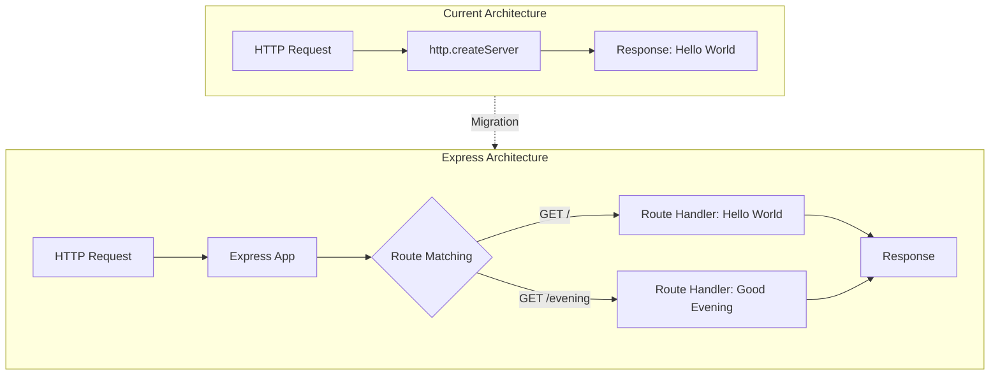

# Technical Specification

# 0. Agent Action Plan

## 0.1 Intent Clarification

### 0.1.1 Core Feature Objective

Based on the prompt, the Blitzy platform understands that the new feature requirement is to:

- **Add Express.js Framework**: Integrate the Express.js web framework into an existing Node.js tutorial project that currently uses the built-in `http` module for serving HTTP requests
- **Create a New Endpoint**: Implement an additional HTTP endpoint that returns the text response "Good evening"
- **Preserve Existing Functionality**: The existing endpoint that returns "Hello world" must continue to work after the migration to Express.js

**Implicit Requirements Detected:**
- Migration of the existing `http` module-based server to Express.js-based architecture
- Proper routing configuration to handle multiple endpoints
- Maintain the same server binding (127.0.0.1:3000) for backward compatibility
- Update package.json to reflect the new Express.js dependency

**Feature Dependencies and Prerequisites:**
- Node.js runtime version 18 or higher (current environment: v20.20.0 ✓)
- npm/yarn package manager for dependency management
- Express.js package version 5.2.1 (latest stable release)

### 0.1.2 Special Instructions and Constraints

**Directives:**
- Integrate Express.js as the primary web framework replacing the raw `http` module approach
- Follow Express.js 5.x conventions for route handling and middleware
- Maintain the minimalist tutorial-style code structure

**Architectural Requirements:**
- Use Express.js routing mechanism (`app.get()`) for endpoint definitions
- Keep the server configuration simple and educational
- Preserve the existing port (3000) and hostname (127.0.0.1) configuration

**User Examples Preserved:**
- User Example (existing response): `"Hello world"` or `"Hello, World!\n"` (current implementation)
- User Example (new response): `"Good evening"`

### 0.1.3 Technical Interpretation

These feature requirements translate to the following technical implementation strategy:

- **To integrate Express.js**, we will install the `express` package (v5.2.1) as a project dependency and refactor `server.js` to use Express's application factory pattern
- **To add the new endpoint**, we will create a new route handler using `app.get('/evening', ...)` that responds with "Good evening"
- **To preserve existing functionality**, we will convert the current `http.createServer` callback into an Express route handler for the root path (`/`) that returns "Hello, World!"
- **To maintain compatibility**, we will use `app.listen(3000, '127.0.0.1', ...)` to bind to the same network interface and port

## 0.2 Repository Scope Discovery

### 0.2.1 Comprehensive File Analysis

**Existing Files Identified for Modification:**

| File Path | Type | Purpose | Required Changes |
|-----------|------|---------|------------------|
| `server.js` | Source | Main HTTP server entry point | Refactor from `http` module to Express.js |
| `package.json` | Config | NPM package manifest | Add Express.js dependency |
| `package-lock.json` | Config | Dependency lock file | Will be regenerated with Express dependencies |
| `README.md` | Documentation | Project documentation | Update to reflect Express.js usage |

**Integration Point Discovery:**

| Component | Location | Integration Action |
|-----------|----------|-------------------|
| HTTP Server | `server.js` lines 1-14 | Replace `http.createServer()` with Express app |
| Route Handler | `server.js` lines 6-9 | Convert to `app.get('/', ...)` route |
| Server Listener | `server.js` lines 12-14 | Update to `app.listen()` pattern |

**Existing Files - No Modification Required:**

| File Path | Reason for Exclusion |
|-----------|---------------------|
| `server - Copy.js` | Backup/duplicate file, not part of active codebase |
| `LoginTest.java` | Java test file, unrelated to Node.js server |
| `LoginTest - Copy.java` | Duplicate Java file |
| `industry.csv` | Static data file, not affected by feature |
| `industry - Copy.csv` | Duplicate data file |
| `100Pages.pdf`, `100Pages - Copy.pdf` | Static document, unrelated |
| `demo.jpg`, `demo - Copy.jpg` | Image assets, unrelated |
| `sample.doc`, `sample - Copy.doc` | Static document, unrelated |
| `test.py.txt`, `test.py - Copy.txt`, `test.txt.txt` | Empty placeholder files |

### 0.2.2 New File Requirements

**New Source Files to Create:**

No new source files need to be created for this feature. The existing `server.js` will be modified in-place to incorporate Express.js functionality.

**New Test Files (Recommended):**

| File Path | Purpose |
|-----------|---------|
| `server.test.js` | Unit tests for Express route handlers (optional enhancement) |

**New Configuration Files:**

| File Path | Purpose |
|-----------|---------|
| `yarn.lock` | Yarn dependency lock file (auto-generated by yarn) |

### 0.2.3 Current Repository Structure

```
/
├── .git/                        # Git repository metadata
├── server.js                    # [MODIFY] Main server entry point
├── server - Copy.js             # Backup file (ignore)
├── package.json                 # [MODIFY] Add express dependency
├── package-lock.json            # [REGENERATE] Lock file
├── README.md                    # [MODIFY] Update documentation
├── LoginTest.java               # Unrelated Java file
├── LoginTest - Copy.java        # Unrelated Java file
├── industry.csv                 # Static data
├── industry - Copy.csv          # Static data copy
├── 100Pages.pdf                 # Static document
├── 100Pages - Copy.pdf          # Static document copy
├── demo.jpg                     # Image asset
├── demo - Copy.jpg              # Image asset copy
├── sample.doc                   # Static document
├── sample - Copy.doc            # Static document copy
├── test.py.txt                  # Empty placeholder
├── test.py - Copy.txt           # Empty placeholder
└── test.txt.txt                 # Empty placeholder
```

### 0.2.4 Web Search Research Conducted

The following research was conducted to inform implementation decisions:

| Research Topic | Finding |
|----------------|---------|
| Express.js Latest Version | v5.2.1 (released November 2024) |
| Node.js Compatibility | Express 5.x requires Node.js 18 or higher |
| Express 5.x Key Changes | Native async/await support, stricter route matching, removed deprecated APIs |
| Express Basic Usage | Standard pattern: `const app = express(); app.get(); app.listen()` |

## 0.3 Dependency Inventory

### 0.3.1 Private and Public Packages

**Key Packages Required for Feature Addition:**

| Registry | Package Name | Version | Purpose |
|----------|--------------|---------|---------|
| npm (public) | express | 5.2.1 | Web framework for Node.js - primary routing and HTTP handling |

**Express.js Transitive Dependencies (Auto-Installed):**

| Package Name | Version | Purpose |
|--------------|---------|---------|
| accepts | 2.0.0 | Content negotiation |
| body-parser | 2.2.2 | Request body parsing middleware |
| content-disposition | 1.0.1 | Content-Disposition header handling |
| cookie | 0.7.2 | Cookie parsing |
| cookie-signature | 1.2.2 | Cookie signing |
| depd | 2.0.0 | Deprecation utilities |
| finalhandler | 2.1.1 | Final HTTP response handler |
| http-errors | 2.0.1 | HTTP error creation |
| merge-descriptors | 2.0.0 | Object descriptor merging |
| mime-db | 1.54.0 | MIME type database |
| path-to-regexp | 8.3.0 | Route path matching |
| proxy-addr | 2.0.7 | Proxy address determination |
| qs | 6.14.1 | Query string parsing |
| raw-body | 3.0.2 | Raw request body reading |
| router | 2.2.0 | HTTP router |
| send | 1.2.1 | Static file serving |
| serve-static | 2.2.1 | Static file middleware |
| vary | 1.1.2 | Vary header manipulation |

### 0.3.2 Dependency Updates

**Package.json Modifications:**

The `package.json` file requires the following updates:

```json
{
  "dependencies": {
    "express": "^5.2.1"
  }
}
```

**Current package.json (Before):**
```json
{
  "name": "hello_world",
  "version": "1.0.0",
  "description": "Hello world in Node.js",
  "main": "index.js"
}
```

**Updated package.json (After):**
```json
{
  "name": "hello_world",
  "version": "1.0.0",
  "description": "Hello world in Node.js with Express",
  "main": "server.js",
  "dependencies": {
    "express": "^5.2.1"
  }
}
```

### 0.3.3 Import Updates

**Files Requiring Import Changes:**

| File Pattern | Import Transformation |
|--------------|----------------------|
| `server.js` | Old: `const http = require('http');` → New: `const express = require('express');` |

**Import Transformation Rules:**

- **Remove**: `const http = require('http');` - No longer needed with Express
- **Add**: `const express = require('express');` - Core Express import
- **Add**: `const app = express();` - Express application instance

### 0.3.4 External Reference Updates

**Configuration Files to Update:**

| File | Update Required |
|------|-----------------|
| `package.json` | Add `dependencies.express: "^5.2.1"`, update `main` to `server.js`, update description |
| `package-lock.json` | Will be regenerated automatically during `npm install` |
| `yarn.lock` | Will be created if using yarn |

**Documentation Updates:**

| File | Update Required |
|------|-----------------|
| `README.md` | Add Express.js installation instructions, update project description |

**Build/CI Files:**

No build or CI configuration files exist in the current repository. No updates needed.

## 0.4 Integration Analysis

### 0.4.1 Existing Code Touchpoints

**Direct Modifications Required:**

| File | Location | Modification Description |
|------|----------|-------------------------|
| `server.js` | Line 1 | Replace `require('http')` with `require('express')` |
| `server.js` | Lines 3-4 | Remove hostname/port constants (move to `app.listen()` directly) |
| `server.js` | Lines 6-10 | Replace `http.createServer()` callback with Express route handlers |
| `server.js` | Lines 12-14 | Replace `server.listen()` with `app.listen()` |
| `package.json` | Root object | Add `dependencies` field with Express.js |

**Current server.js Code Analysis:**

```javascript
// Line 1: HTTP module import - REPLACE
const http = require('http');

// Lines 3-4: Server configuration - RETAIN VALUES
const hostname = '127.0.0.1';
const port = 3000;

// Lines 6-10: Request handler - CONVERT TO EXPRESS ROUTE
const server = http.createServer((req, res) => {
  res.statusCode = 200;
  res.setHeader('Content-Type', 'text/plain');
  res.end('Hello, World!\n');
});

// Lines 12-14: Server start - CONVERT TO EXPRESS LISTEN
server.listen(port, hostname, () => {
  console.log(`Server running at http://${hostname}:${port}/`);
});
```

### 0.4.2 Dependency Injections

This simple tutorial project does not use dependency injection patterns. No changes required in this area.

### 0.4.3 Database/Schema Updates

This project does not have any database or schema components. No changes required in this area.

### 0.4.4 API Endpoint Mapping

**Current Endpoint (to be migrated):**

| Method | Path | Response | Status |
|--------|------|----------|--------|
| ANY | `/*` (all paths) | `Hello, World!\n` | 200 |

**Target Endpoints (after Express migration):**

| Method | Path | Response | Content-Type | Status |
|--------|------|----------|--------------|--------|
| GET | `/` | `Hello, World!` | text/plain | 200 |
| GET | `/evening` | `Good evening` | text/plain | 200 |

### 0.4.5 Integration Flow Diagram



### 0.4.6 Middleware Considerations

For this basic tutorial implementation, no middleware is required. However, Express.js 5.x provides built-in middleware that may be useful for future enhancements:

| Middleware | Purpose | Required for Feature |
|------------|---------|---------------------|
| `express.json()` | Parse JSON request bodies | No |
| `express.urlencoded()` | Parse URL-encoded bodies | No |
| `express.static()` | Serve static files | No |

The implementation will use only the core Express routing functionality without additional middleware.

## 0.5 Technical Implementation

### 0.5.1 File-by-File Execution Plan

**CRITICAL: Every file listed here MUST be created or modified**

**Group 1 - Core Feature Files:**

| Action | File Path | Implementation Details |
|--------|-----------|----------------------|
| MODIFY | `server.js` | Refactor entire file to use Express.js framework, implement two route handlers |

**Group 2 - Configuration Files:**

| Action | File Path | Implementation Details |
|--------|-----------|----------------------|
| MODIFY | `package.json` | Add Express.js dependency, update main entry point and description |

**Group 3 - Documentation:**

| Action | File Path | Implementation Details |
|--------|-----------|----------------------|
| MODIFY | `README.md` | Update to document Express.js usage and available endpoints |

### 0.5.2 Implementation Approach per File

## server.js - Complete Refactoring

**Transformation Steps:**

1. Replace `http` module import with `express` import
2. Create Express application instance using `express()`
3. Define GET route handler for root path (`/`) returning "Hello, World!"
4. Define GET route handler for evening path (`/evening`) returning "Good evening"
5. Start server using `app.listen()` with the same port configuration

**Target Implementation:**

```javascript
const express = require('express');
const app = express();

const hostname = '127.0.0.1';
const port = 3000;

app.get('/', (req, res) => {
  res.type('text/plain').send('Hello, World!\n');
});

app.get('/evening', (req, res) => {
  res.type('text/plain').send('Good evening');
});

app.listen(port, hostname, () => {
  console.log(`Server running at http://${hostname}:${port}/`);
});
```

## package.json - Dependency Addition

**Changes Required:**
- Add `dependencies` object with `express: "^5.2.1"`
- Update `main` field from `index.js` to `server.js`
- Update `description` to reflect Express.js usage

## README.md - Documentation Update

**Content to Add:**
- Project description mentioning Express.js
- Installation instructions (`npm install` or `yarn install`)
- Available endpoints documentation
- How to run the server

### 0.5.3 Implementation Sequence


**Step-by-Step Execution:**

1. **Update package.json** - Add Express.js dependency
2. **Install Dependencies** - Run `npm install` or `yarn install`
3. **Refactor server.js** - Replace http module code with Express implementation
4. **Update README.md** - Document the new endpoints and Express.js usage
5. **Test Endpoints** - Verify both `/` and `/evening` routes work correctly

### 0.5.4 Verification Commands

After implementation, verify the feature works correctly:

```bash
# Start the server

node server.js

#### Test root endpoint (in another terminal)

curl http://127.0.0.1:3000/
# Expected: Hello, World!

#### Test evening endpoint

curl http://127.0.0.1:3000/evening
# Expected: Good evening

```

### 0.5.5 Error Handling Considerations

Express.js 5.x provides automatic error handling for unhandled routes (404) and server errors (500). For this tutorial implementation:

- Unmatched routes will automatically return 404 status
- Async errors in route handlers are automatically caught and passed to error middleware
- No custom error handling middleware is required for basic functionality

### 0.5.6 User Interface Design

This feature does not include any user interface components. The implementation is a backend API server returning plain text responses. No Figma URLs were provided for this feature.

## 0.6 Scope Boundaries

### 0.6.1 Exhaustively In Scope

**Source Files:**

| File Pattern | Specific Files | Scope Details |
|--------------|----------------|---------------|
| `server.js` | Main entry point | Complete refactoring to Express.js |
| `*.json` | `package.json` | Dependency and configuration updates |

**Configuration Files:**

| File | Scope Details |
|------|---------------|
| `package.json` | Add Express.js dependency, update main entry and description |
| `package-lock.json` | Auto-regenerate after dependency installation |
| `yarn.lock` | Auto-generate if using yarn |

**Documentation:**

| File | Scope Details |
|------|---------------|
| `README.md` | Update with Express.js information and endpoint documentation |

**Complete In-Scope File List:**

```
/
├── server.js            ✓ IN SCOPE - Full refactoring
├── package.json         ✓ IN SCOPE - Add dependency
├── package-lock.json    ✓ IN SCOPE - Regenerate
└── README.md            ✓ IN SCOPE - Update documentation
```

### 0.6.2 Explicitly Out of Scope

**Unrelated Files (No Modifications):**

| File/Pattern | Reason for Exclusion |
|--------------|---------------------|
| `server - Copy.js` | Backup/duplicate file, not active code |
| `LoginTest.java` | Java test file, unrelated technology |
| `LoginTest - Copy.java` | Duplicate Java file |
| `industry.csv` | Static data asset |
| `industry - Copy.csv` | Duplicate data asset |
| `100Pages.pdf` | Static document |
| `100Pages - Copy.pdf` | Duplicate document |
| `demo.jpg` | Image asset |
| `demo - Copy.jpg` | Duplicate image |
| `sample.doc` | Static document |
| `sample - Copy.doc` | Duplicate document |
| `test.py.txt` | Empty placeholder file |
| `test.py - Copy.txt` | Empty placeholder file |
| `test.txt.txt` | Empty placeholder file |
| `.git/**` | Git repository metadata |

**Features Explicitly Out of Scope:**

| Feature | Reason |
|---------|--------|
| Additional endpoints beyond `/` and `/evening` | Not requested by user |
| Middleware implementation (logging, CORS, etc.) | Not required for basic feature |
| Database integration | Not requested |
| Authentication/Authorization | Not requested |
| Unit test implementation | Not explicitly requested |
| Docker containerization | Not requested |
| CI/CD pipeline setup | Not requested |
| TypeScript migration | Not requested |
| Environment variable configuration | Not requested for tutorial project |
| Error handling middleware | Basic Express defaults sufficient |
| Static file serving | Not requested |
| Template engine integration | Not requested |

**Performance Optimizations Out of Scope:**

| Optimization | Reason |
|--------------|--------|
| Clustering/load balancing | Overkill for tutorial project |
| Response caching | Not needed for simple text responses |
| Compression middleware | Not requested |
| Rate limiting | Not requested |

### 0.6.3 Scope Summary Table

| Category | In Scope | Out of Scope |
|----------|----------|--------------|
| Files to Modify | 3 files | 15+ files |
| New Endpoints | 1 (`/evening`) | Any additional endpoints |
| Dependencies | Express.js only | Any other packages |
| Documentation | README.md update | API documentation tools |
| Testing | Manual verification | Automated test suite |

## 0.7 Rules for Feature Addition

### 0.7.1 Feature-Specific Rules

**Express.js Integration Rules:**

| Rule | Description |
|------|-------------|
| Use Express 5.x Patterns | Follow Express.js 5.x conventions for route handlers and middleware |
| Maintain Tutorial Simplicity | Keep code educational and easy to understand |
| Preserve Server Configuration | Maintain the same hostname (127.0.0.1) and port (3000) |
| Use CommonJS Modules | Continue using `require()` syntax consistent with existing code |

**Code Style Rules:**

| Rule | Rationale |
|------|-----------|
| Keep route handlers simple | Tutorial project should remain beginner-friendly |
| Use explicit content-type setting | Ensure consistent response headers with original implementation |
| Maintain consistent formatting | Follow existing code style patterns |

### 0.7.2 Integration Requirements

**Backward Compatibility:**

| Requirement | Implementation |
|-------------|----------------|
| Preserve root endpoint behavior | GET `/` must return "Hello, World!" with 200 status |
| Maintain server binding | Server must listen on 127.0.0.1:3000 |
| Keep startup message | Console log should show server URL on startup |

**Response Format Consistency:**

| Endpoint | Response Text | Content-Type |
|----------|---------------|--------------|
| GET `/` | `Hello, World!` (with or without newline) | text/plain |
| GET `/evening` | `Good evening` | text/plain |

### 0.7.3 Performance Considerations

For this tutorial-level project, performance optimization is not a primary concern. However, the following basic guidelines apply:

| Consideration | Guideline |
|---------------|-----------|
| Response Size | Keep responses minimal (plain text) |
| Middleware Usage | Avoid unnecessary middleware |
| Memory | No in-memory caching required |
| Concurrent Requests | Express handles concurrency by default |

### 0.7.4 Security Requirements

Basic security considerations for this tutorial project:

| Requirement | Implementation |
|-------------|----------------|
| Local Binding | Server binds to 127.0.0.1 (localhost only) - maintains original security posture |
| No Sensitive Data | Responses contain only static text, no security concerns |
| Input Validation | Not required for GET-only endpoints with no parameters |

### 0.7.5 Testing Requirements

Minimum testing requirements for feature acceptance:

| Test Case | Expected Result |
|-----------|-----------------|
| GET http://127.0.0.1:3000/ | Response: "Hello, World!" with status 200 |
| GET http://127.0.0.1:3000/evening | Response: "Good evening" with status 200 |
| Server startup | Console displays "Server running at http://127.0.0.1:3000/" |
| Express dependency | `npm ls express` shows express@5.2.1 installed |

### 0.7.6 User-Specified Requirements

The user did not specify additional rules or constraints beyond:
- Add Express.js to the project
- Add an endpoint returning "Good evening"
- Preserve existing "Hello world" functionality

## 0.8 References

### 0.8.1 Repository Files Analyzed

**Primary Source Files:**

| File Path | Purpose | Key Findings |
|-----------|---------|--------------|
| `/server.js` | Main HTTP server | Uses built-in `http` module, single callback handler, binds to 127.0.0.1:3000 |
| `/package.json` | NPM manifest | No dependencies defined, main entry set to index.js (incorrect), MIT license |
| `/package-lock.json` | Lock file | Empty dependency tree, lockfileVersion 3 |
| `/README.md` | Documentation | Minimal content, contains project name only |
| `/server - Copy.js` | Backup file | Duplicate of server.js, excluded from modifications |

**Additional Files Reviewed:**

| File Path | Purpose | Relevance |
|-----------|---------|-----------|
| `/LoginTest.java` | Java test stub | Not relevant - different technology |
| `/LoginTest - Copy.java` | Java test stub | Not relevant - duplicate |
| `/industry.csv` | Static data | Not relevant to server feature |
| `/industry - Copy.csv` | Static data | Not relevant - duplicate |

### 0.8.2 Folders Searched

| Folder Path | Contents | Outcome |
|-------------|----------|---------|
| `/` (root) | All project files | Complete inventory of 12+ files |
| `/.git/` | Git metadata | Not analyzed (repository internals) |

### 0.8.3 Web Research Sources

| Topic | Source | Key Information Retrieved |
|-------|--------|--------------------------|
| Express.js Latest Version | npmjs.com/package/express | Version 5.2.1 is latest stable |
| Express.js Requirements | expressjs/express GitHub | Requires Node.js 18+ |
| Express 5.x Features | GitHub releases | Native async/await support, stricter routing |
| Express Migration Guide | expressjs.com | Breaking changes from v4 to v5 |

### 0.8.4 External Documentation Referenced

| Resource | URL | Purpose |
|----------|-----|---------|
| Express.js npm Package | https://www.npmjs.com/package/express | Version verification |
| Express.js GitHub Releases | https://github.com/expressjs/express/releases | Release notes and changelog |
| Express.js Official Site | https://expressjs.com | API documentation reference |

### 0.8.5 Attachments Provided

No file attachments were provided by the user for this feature request.

### 0.8.6 Figma URLs Provided

No Figma design URLs were provided for this feature request. This is a backend-only API feature with no user interface components.

### 0.8.7 Environment Details

| Component | Version/Details |
|-----------|-----------------|
| Node.js Runtime | v20.20.0 |
| npm Version | v11.1.0 |
| Package Manager Used | yarn v1.22.22 (due to npm tracker issues) |
| Operating System | Linux 6.9.12 |
| Project Location | `/tmp/blitzy/29-dec-existing-projects-qa-test-4/QABranch19Jan/` |

### 0.8.8 Validation Performed

| Validation | Command | Result |
|------------|---------|--------|
| Current server functionality | `node server.js` + `curl localhost:3000` | Returns "Hello, World!" ✓ |
| Node.js compatibility | `node --version` | v20.20.0 (compatible with Express 5.x) ✓ |
| Express installation | `yarn add express@^5.2.1` | Successfully installed 46 packages ✓ |

