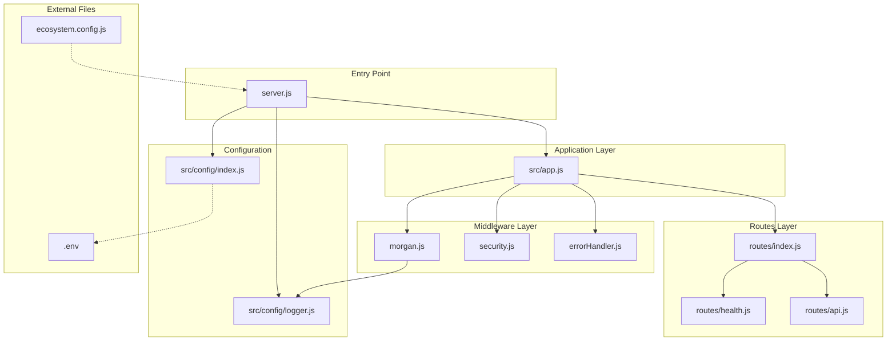

# Technical Specification

# 0. Agent Action Plan

## 0.1 Intent Clarification

### 0.1.1 Core Objective

Based on the provided requirements, the Blitzy platform understands that the objective is to transform a basic Node.js HTTP server into a production-ready Express.js application with enterprise-grade features. Specifically:

- **Convert native HTTP to Express.js**: Replace the existing `http` module implementation with Express.js framework (version 5.x) for robust routing and middleware support
- **Implement structured routing**: Create a modular routing architecture separating concerns across different route files
- **Add middleware layer**: Implement request processing middleware for logging, parsing, security, and error handling
- **Configure environment management**: Establish environment-based configuration using dotenv for secure variable management
- **Enable comprehensive logging**: Integrate Morgan for HTTP request logging and Winston for application-level logging
- **Prepare production deployment**: Configure PM2 process manager with ecosystem file for production-ready deployment with clustering, auto-restart, and monitoring

The implicit requirements surfaced include:
- Creating a proper project directory structure following Express.js best practices
- Adding security middleware (helmet, rate limiting) for production hardening
- Implementing error handling middleware with proper status codes
- Creating development and production environment configurations
- Adding npm scripts for development, production, and PM2 management

### 0.1.2 Task Categorization

- **Primary task type**: Configuration / Feature Enhancement
- **Secondary aspects**: Infrastructure setup, Production hardening, Code refactoring
- **Scope classification**: Cross-cutting change (affects entry point, package configuration, directory structure, and deployment)

### 0.1.3 Special Instructions and Constraints

- **Framework migration**: The existing `server.js` uses native Node.js `http` module and must be refactored to use Express.js while maintaining the same port (3000 default) and basic HTTP endpoint functionality
- **Backward compatibility**: The "Hello, World!" response at the root path should remain functional after migration
- **Production readiness**: The final implementation must be deployable via PM2 with zero-downtime reload capability
- **Modular structure**: Follow Express.js community conventions for folder organization with separate directories for routes, middleware, config, and utilities
- **Environment separation**: Support for at least development and production environments with appropriate logging levels

### 0.1.4 Technical Interpretation

These requirements translate to the following technical implementation strategy:

- To **achieve Express.js migration**, we will refactor `server.js` to import Express, create an application instance, and configure middleware chain before defining routes
- To **implement routing**, we will create a `src/routes/` directory with modular route files and a central router index that aggregates all routes
- To **add middleware**, we will create a `src/middleware/` directory containing logging, error handling, and security middleware configurations
- To **configure environments**, we will create `.env` and `.env.example` files with `dotenv` integration and a `src/config/` directory for centralized configuration management
- To **enable logging**, we will configure Winston as the primary logger with file and console transports, and integrate Morgan for HTTP request logging piped through Winston
- To **prepare for PM2 deployment**, we will create `ecosystem.config.js` with cluster mode, environment-specific configurations, and proper restart policies

## 0.2 Repository Scope Discovery

### 0.2.1 Comprehensive File Analysis

The repository has been thoroughly analyzed. The current project structure is minimal:

| File | Type | Purpose | Relevance |
|------|------|---------|-----------|
| `server.js` | Source code | Basic HTTP server using native `http` module | **Primary target** - requires complete refactoring |
| `package.json` | Configuration | NPM package manifest with no dependencies | **Primary target** - requires dependency additions |
| `package-lock.json` | Lock file | NPM dependency lock (empty) | Will be regenerated |
| `README.md` | Documentation | Project description (contains test warning) | May require update |

**Current `server.js` implementation analysis:**
```javascript
// Uses native http module - NO Express
const http = require('http');
// Serves "Hello, World!" on port 3000
```

**Current `package.json` analysis:**
```json
{
  "name": "blitzy-basic-app",
  "version": "1.0.0",
  "main": "server.js"
  // NO dependencies defined
}
```

### 0.2.2 Web Search Research Conducted

Research was conducted on the following topics to validate implementation approach:

| Topic | Key Findings |
|-------|--------------|
| Express.js 5.x best practices 2025 | Express 5.2.1 is latest stable; requires Node.js 18+; improved promise handling; modular folder structure recommended |
| PM2 ecosystem configuration | Use `ecosystem.config.js` with cluster mode; configure `env_production` and `env_development`; enable auto-restart and memory limits |
| Morgan + Winston logging | Morgan handles HTTP request logging; Winston for application logs; pipe Morgan output through Winston stream for unified logging |
| dotenv environment configuration | Use `dotenv.config()` at application entry; separate `.env` files per environment; never commit secrets to version control |
| Express security middleware | Use `helmet` for HTTP headers; `express-rate-limit` for DOS protection; set `trust proxy` in production |
| Node.js production deployment | Set `NODE_ENV=production`; use clustering for multi-core utilization; implement graceful shutdown handlers |

### 0.2.3 Existing Infrastructure Assessment

**Current project structure:**
```
/
├── server.js              # Main entry (native http)
├── package.json           # Package manifest (empty deps)
├── package-lock.json      # Lock file
└── README.md              # Documentation
```

**Patterns and conventions identified:**
- CommonJS module system (`require()` syntax)
- No existing framework conventions to follow
- No existing middleware patterns
- No configuration management in place
- No logging infrastructure present

**Build and deployment configurations:**
- None present - project requires complete setup

**Testing infrastructure:**
- None present - out of scope for this enhancement

**Documentation system:**
- Basic README.md exists with warning note

## 0.3 File Transformation Mapping

### 0.3.1 File-by-File Execution Plan

| Target File | Transformation | Source File/Reference | Purpose/Changes |
|-------------|----------------|----------------------|-----------------|
| `server.js` | UPDATE | `server.js` | Refactor to Express.js entry point; initialize app, load config, configure middleware, mount routes, start server |
| `package.json` | UPDATE | `package.json` | Add dependencies, scripts for dev/prod/PM2, engine requirements |
| `src/app.js` | CREATE | Express best practices | Express app factory; middleware setup; route mounting; error handler attachment |
| `src/config/index.js` | CREATE | dotenv patterns | Centralized configuration export; environment variable validation |
| `src/config/logger.js` | CREATE | Winston docs | Winston logger instance with console and file transports |
| `src/middleware/morgan.js` | CREATE | Morgan + Winston integration | Morgan middleware configured to use Winston stream |
| `src/middleware/errorHandler.js` | CREATE | Express error handling patterns | Global error handling middleware with environment-aware responses |
| `src/middleware/security.js` | CREATE | helmet + rate-limit docs | Security middleware configuration (helmet, rate limiting) |
| `src/middleware/index.js` | CREATE | Barrel export pattern | Export all middleware from single entry point |
| `src/routes/index.js` | CREATE | Express Router patterns | Central router aggregating all route modules |
| `src/routes/health.js` | CREATE | Best practices | Health check endpoint for monitoring/PM2 |
| `src/routes/api.js` | CREATE | Best practices | Sample API routes demonstrating structure |
| `.env` | CREATE | dotenv docs | Environment variables for development |
| `.env.example` | CREATE | dotenv docs | Template showing required environment variables |
| `.gitignore` | CREATE | Node.js patterns | Ignore node_modules, .env, logs directory |
| `ecosystem.config.js` | CREATE | PM2 docs | PM2 process configuration with cluster mode |
| `logs/.gitkeep` | CREATE | Convention | Placeholder to maintain logs directory in git |

### 0.3.2 New Files Detail

**`src/app.js`** - Express application factory
- Content type: Source code (JavaScript)
- Based on: Express.js best practices and modular patterns
- Key sections/functions:
  - Express app initialization
  - Body parser middleware (JSON, URL-encoded)
  - Security middleware attachment (helmet, CORS)
  - Logging middleware (Morgan)
  - Route mounting
  - 404 handler
  - Error handler attachment
  - App export for server.js consumption

**`src/config/index.js`** - Configuration manager
- Content type: Configuration
- Based on: dotenv and 12-factor app methodology
- Key sections/functions:
  - dotenv initialization
  - Environment variable extraction with defaults
  - Configuration validation
  - Exported config object

**`src/config/logger.js`** - Winston logger setup
- Content type: Source code
- Based on: Winston documentation and best practices
- Key sections/functions:
  - Log levels definition (error, warn, info, http, debug)
  - Console transport with colorization
  - File transport for errors and combined logs
  - Conditional debug logging based on NODE_ENV

**`ecosystem.config.js`** - PM2 configuration
- Content type: Configuration
- Based on: PM2 ecosystem file documentation
- Key sections/functions:
  - Application name and script path
  - Cluster mode with instance count
  - Memory restart threshold
  - Environment variables for dev/prod
  - Log file paths
  - Watch configuration (development only)

### 0.3.3 Files to Modify Detail

**`server.js`** - Transform from native HTTP to Express server
- Sections to update: Entire file requires refactoring
- New content to add:
  - Import app from `src/app.js`
  - Import config from `src/config`
  - Import logger from `src/config/logger`
  - Server startup logic with graceful shutdown
  - Uncaught exception and unhandled rejection handlers
- Content to remove:
  - Native `http` module import and usage
  - Inline request handler
- Refactoring needed: Complete rewrite maintaining port 3000 default

**`package.json`** - Add dependencies and scripts
- Sections to update: dependencies, devDependencies, scripts, engines
- New content to add:
  - Express.js and related middleware dependencies
  - dotenv, winston, morgan packages
  - PM2 as devDependency
  - npm scripts for start, dev, prod, pm2:start, pm2:stop
  - Node.js engine requirement (>=18.0.0)
- Content to remove: None

### 0.3.4 Configuration and Documentation Updates

**Configuration changes:**
- `package.json`: Add scripts section with `start`, `dev`, `start:prod`, `pm2:start`, `pm2:stop`, `pm2:logs`
- `.env`: Define PORT, NODE_ENV, LOG_LEVEL variables
- `ecosystem.config.js`: Configure PM2 for production deployment

**Documentation updates:**
- `README.md`: Consider updating with setup and deployment instructions (optional based on test project status)

### 0.3.5 Cross-File Dependencies

**Import/reference updates required:**
- `server.js` imports `app` from `./src/app`
- `server.js` imports `config` from `./src/config`
- `server.js` imports `logger` from `./src/config/logger`
- `src/app.js` imports all middleware from `./middleware`
- `src/app.js` imports all routes from `./routes`
- `src/middleware/morgan.js` imports `logger` from `../config/logger`
- All route files import `express.Router()`

**Configuration sync requirements:**
- `.env` variables must match `src/config/index.js` expected keys
- `ecosystem.config.js` environment must align with `.env` structure

**Documentation consistency needs:**
- README.md should reflect new project structure and commands

## 0.4 Dependency Inventory

### 0.4.1 Key Private and Public Packages

| Registry | Package Name | Version | Purpose |
|----------|--------------|---------|---------|
| npm | express | ^5.2.1 | Web application framework - core Express.js server |
| npm | dotenv | ^16.4.5 | Environment variable management from .env files |
| npm | winston | ^3.17.0 | Application logging with multiple transports |
| npm | morgan | ^1.10.0 | HTTP request logging middleware for Express |
| npm | helmet | ^8.0.0 | Security HTTP headers middleware |
| npm | express-rate-limit | ^7.5.0 | Rate limiting middleware for DOS protection |
| npm | cors | ^2.8.5 | Cross-Origin Resource Sharing middleware |
| npm | pm2 | ^5.4.3 | Production process manager (devDependency) |

### 0.4.2 Dependency Updates

**New dependencies to add (Production):**

| Package | Version | Reason for Addition |
|---------|---------|---------------------|
| express | ^5.2.1 | Core framework replacing native http module; Express 5.x is now the npm default with improved promise support and security |
| dotenv | ^16.4.5 | Load environment variables from .env file following 12-factor app principles |
| winston | ^3.17.0 | Versatile logging library supporting multiple transports, log levels, and formats |
| morgan | ^1.10.0 | HTTP request logger middleware that integrates with Winston for unified logging |
| helmet | ^8.0.0 | Secures Express apps by setting various HTTP headers (XSS, HSTS, etc.) |
| express-rate-limit | ^7.5.0 | Basic rate-limiting middleware to protect against brute-force and DOS attacks |
| cors | ^2.8.5 | Enable CORS with various options for API accessibility |

**New devDependencies to add:**

| Package | Version | Reason for Addition |
|---------|---------|---------------------|
| pm2 | ^5.4.3 | Production process manager for Node.js with clustering, monitoring, and auto-restart |

**Dependencies to update:**
- None (no existing dependencies)

**Dependencies to remove:**
- None (no existing dependencies)

### 0.4.3 Import/Reference Updates

**Files requiring import updates:**

| File Pattern | Import Changes |
|--------------|----------------|
| `server.js` | Add imports for app, config, logger modules |
| `src/app.js` | Import express, helmet, cors, middleware, routes |
| `src/config/index.js` | Import dotenv for configuration loading |
| `src/config/logger.js` | Import winston for logger creation |
| `src/middleware/morgan.js` | Import morgan and logger |
| `src/middleware/security.js` | Import helmet and express-rate-limit |
| `src/routes/*.js` | Import express.Router |

**Import transformation rules:**

```javascript
// OLD: Native http (to be replaced)
const http = require('http');

// NEW: Express and ecosystem
const express = require('express');
const helmet = require('helmet');
const cors = require('cors');
const morgan = require('morgan');
const winston = require('winston');
const dotenv = require('dotenv');
const rateLimit = require('express-rate-limit');
```

Apply to: `server.js`, `src/app.js`, `src/config/*.js`, `src/middleware/*.js`

### 0.4.4 Package.json Updates

The `package.json` file requires the following modifications:

```json
{
  "name": "blitzy-basic-app",
  "version": "1.0.0",
  "main": "server.js",
  "engines": {
    "node": ">=18.0.0"
  },
  "scripts": {
    "start": "node server.js",
    "dev": "NODE_ENV=development node server.js",
    "start:prod": "NODE_ENV=production node server.js",
    "pm2:start": "pm2 start ecosystem.config.js",
    "pm2:stop": "pm2 stop ecosystem.config.js",
    "pm2:restart": "pm2 restart ecosystem.config.js",
    "pm2:logs": "pm2 logs"
  },
  "dependencies": {
    "cors": "^2.8.5",
    "dotenv": "^16.4.5",
    "express": "^5.2.1",
    "express-rate-limit": "^7.5.0",
    "helmet": "^8.0.0",
    "morgan": "^1.10.0",
    "winston": "^3.17.0"
  },
  "devDependencies": {
    "pm2": "^5.4.3"
  }
}
```

## 0.5 Implementation Design

### 0.5.1 Technical Approach

**Primary objectives with implementation approach:**

- **Achieve Express.js migration** by refactoring `server.js` to use Express application factory pattern, separating app configuration from server startup for better testability and modularity

- **Implement modular routing** by creating route modules under `src/routes/` with Express Router, aggregating them through a central index file, and mounting at appropriate path prefixes

- **Add comprehensive middleware** by creating dedicated middleware files for logging (Morgan/Winston), security (helmet, rate limiting), and error handling, configured in proper execution order

- **Enable environment configuration** by using dotenv to load `.env` variables into `process.env`, centralizing access through a config module with validation and sensible defaults

- **Prepare PM2 deployment** by creating `ecosystem.config.js` with cluster mode, environment-specific configurations, log management, and auto-restart policies

**Logical implementation flow:**

1. **First**, establish foundation by creating project directory structure (`src/config`, `src/middleware`, `src/routes`, `logs`) and configuring `package.json` with all dependencies

2. **Next**, implement configuration layer by creating `src/config/index.js` (environment management) and `src/config/logger.js` (Winston setup)

3. **Then**, create middleware layer by implementing `src/middleware/morgan.js` (HTTP logging), `src/middleware/security.js` (helmet, rate limit), and `src/middleware/errorHandler.js`

4. **After that**, build routing layer by creating `src/routes/health.js` (health checks), `src/routes/api.js` (sample API), and `src/routes/index.js` (route aggregator)

5. **Subsequently**, create Express app factory in `src/app.js` that assembles middleware and routes in proper order

6. **Finally**, refactor `server.js` to import and start the Express app, add graceful shutdown handlers, and create `ecosystem.config.js` for PM2

### 0.5.2 Component Impact Analysis

**Direct modifications required:**

| Component | Modification | Capability Enabled |
|-----------|--------------|-------------------|
| `server.js` | Complete refactoring | Express server startup with graceful shutdown |
| `package.json` | Add dependencies and scripts | Framework support and PM2 deployment |

**Indirect impacts and dependencies:**

| Component | Impact | Reason |
|-----------|--------|--------|
| Project structure | New directories required | Express modular architecture needs `src/` hierarchy |
| Environment | New `.env` files needed | Configuration management requires environment files |
| Git | New `.gitignore` needed | Must exclude node_modules, .env, logs from version control |
| Deployment | PM2 ecosystem file | Production deployment requires process manager configuration |

**New components introduction:**

| Component | Type | Responsibility | Rationale |
|-----------|------|----------------|-----------|
| `src/app.js` | Application factory | Assembles Express app with middleware and routes | Separation of concerns; enables testing |
| `src/config/` | Configuration module | Centralizes environment and logging config | Single source of truth for settings |
| `src/middleware/` | Middleware layer | Request processing pipeline | Modular, reusable request handlers |
| `src/routes/` | Route layer | HTTP endpoint definitions | Clean API structure |
| `ecosystem.config.js` | PM2 configuration | Production deployment settings | Professional deployment management |

### 0.5.3 Critical Implementation Details

**Design patterns employed:**
- **Factory Pattern**: `src/app.js` creates configured Express instances
- **Module Pattern**: Each file exports specific functionality
- **Middleware Chain**: Ordered pipeline for request processing
- **Barrel Exports**: Index files aggregate related modules

**Key algorithms and approaches:**
- Middleware ordering: Security → Body parsing → Logging → Routes → Error handling
- Logger configuration: Environment-aware log levels (debug in dev, info in prod)
- Graceful shutdown: SIGTERM/SIGINT handlers with server.close() and process.exit()

**Integration strategies:**
- Morgan pipes logs through Winston stream for unified logging
- dotenv loads first, before any config access
- Routes mounted after middleware, before error handlers

**Data flow modifications:**

```
Request → helmet → cors → body-parser → morgan → routes → response
                                                    ↓
                                              error-handler (if error)
```

**Error handling considerations:**
- Express 5.x automatic promise rejection handling
- Centralized error handler middleware
- Environment-aware error responses (stack trace in dev only)
- Uncaught exception and unhandled rejection handlers in server.js

**Performance considerations:**
- PM2 cluster mode for multi-core utilization
- Rate limiting to prevent abuse
- Efficient logging with Winston transports

**Security considerations:**
- Helmet for secure HTTP headers
- Rate limiting for DOS protection
- Environment variables for secrets (never hardcoded)
- Trust proxy setting for production behind reverse proxy

### 0.5.4 Architecture Diagram



## 0.6 Scope Boundaries

### 0.6.1 Exhaustively In Scope

**Source code changes:**
- `server.js` - Complete refactoring to Express.js with graceful shutdown
- `src/app.js` - New Express application factory
- `src/config/index.js` - Environment configuration module
- `src/config/logger.js` - Winston logger configuration
- `src/middleware/morgan.js` - HTTP request logging middleware
- `src/middleware/security.js` - Helmet and rate limiting middleware
- `src/middleware/errorHandler.js` - Global error handling middleware
- `src/middleware/index.js` - Middleware barrel export
- `src/routes/index.js` - Route aggregator
- `src/routes/health.js` - Health check endpoint
- `src/routes/api.js` - Sample API routes

**Configuration updates:**
- `package.json` - Dependencies, scripts, engine requirements
- `.env` - Development environment variables
- `.env.example` - Environment variable template
- `ecosystem.config.js` - PM2 process manager configuration
- `.gitignore` - Version control exclusions

**Directory structure creation:**
- `src/` - Source code root
- `src/config/` - Configuration modules
- `src/middleware/` - Middleware modules
- `src/routes/` - Route modules
- `logs/` - Application log files directory

**Documentation updates (minimal):**
- `README.md` - May be updated with new setup instructions

### 0.6.2 Explicitly Out of Scope

**Related features NOT included:**
- Database integration (MongoDB, PostgreSQL, etc.)
- Authentication/Authorization (JWT, OAuth, sessions)
- API documentation (Swagger/OpenAPI)
- WebSocket implementation
- GraphQL integration
- Template engines (EJS, Pug, Handlebars)
- Static file serving beyond basic Express.static

**Performance optimizations beyond requirements:**
- Response caching (Redis, in-memory)
- CDN configuration
- Compression middleware (although trivial to add)
- Connection pooling

**Refactoring unrelated to core objectives:**
- Test file cleanup (Java stubs, CSV files remain untouched)
- Code style enforcement (ESLint, Prettier)
- Type definitions (TypeScript conversion)

**Additional tooling NOT mentioned:**
- Docker containerization
- CI/CD pipelines (GitHub Actions, GitLab CI)
- Monitoring services (DataDog, New Relic)
- APM integration

**Future enhancements NOT part of current request:**
- API versioning strategy
- Request validation (Joi, Zod)
- OpenTelemetry tracing
- Microservices architecture
- Load balancing configuration

**Items explicitly excluded:**
- Modifying unrelated test files (`LoginTest.java`, `userTestData.csv`, etc.)
- Upgrading Node.js version (current v20.x is compatible)
- Changing the default port from 3000 (configurable via .env)
- Implementing HTTPS (assumed to be handled by reverse proxy in production)

### 0.6.3 Boundary Summary Table

| Category | In Scope | Out of Scope |
|----------|----------|--------------|
| Framework | Express.js 5.x migration | Alternative frameworks (Fastify, Koa) |
| Routing | Basic route structure | Complex API versioning |
| Middleware | Logging, security, error handling | Authentication, caching |
| Config | dotenv environment management | Secrets management services |
| Logging | Winston + Morgan | APM, distributed tracing |
| Deployment | PM2 ecosystem config | Docker, Kubernetes, CI/CD |
| Security | Helmet, rate limiting | OAuth, JWT, RBAC |
| Testing | None | Unit tests, integration tests |
| Documentation | Minimal README updates | API docs, Swagger |

## 0.7 Execution Parameters

### 0.7.1 Special Execution Instructions

**Process-specific requirements:**
- Maintain CommonJS module syntax (`require`/`module.exports`) for consistency with existing codebase
- Preserve backward compatibility: Root endpoint must continue serving "Hello, World!" response
- Use Express 5.x which is now the npm default (replaces long-standing 4.x)
- Configure PM2 for production with cluster mode matching available CPU cores

**Tools and platforms:**
- npm for dependency management
- PM2 for production process management
- Node.js v18+ (Express 5.x requirement; current v20.x is compatible)

**Quality requirements:**
- All endpoints must return appropriate HTTP status codes
- Errors must be caught and logged appropriately
- Configuration must be externalized (no hardcoded values)
- Security headers must be set via Helmet

**Code review considerations:**
- Ensure middleware is applied in correct order
- Verify environment variables have sensible defaults
- Confirm graceful shutdown handlers are implemented

**Deployment considerations:**
- Application should start cleanly with `npm start`
- PM2 should manage application in production with `pm2 start ecosystem.config.js --env production`
- Zero-downtime restarts available via `pm2 reload`

### 0.7.2 Constraints and Boundaries

**Technical constraints:**
- Node.js v18.0.0 or higher (Express 5.x requirement)
- npm as package manager (lockfile format)
- CommonJS modules (not ES modules)
- Port 3000 as default (configurable via PORT environment variable)

**Process constraints:**
- DO: Create all necessary files and directories
- DO: Add all required dependencies
- DO: Configure PM2 for production
- DO NOT: Remove or modify unrelated files (test stubs)
- DO NOT: Change module system to ES modules
- DO NOT: Implement features beyond stated requirements

**Output constraints:**
- Generated code must be immediately runnable
- Configuration files must be valid syntax
- PM2 ecosystem file must enable production deployment

**Compatibility requirements:**
- Express 5.x API compatibility
- Node.js v18+ compatibility
- PM2 5.x ecosystem file format

### 0.7.3 npm Scripts Reference

| Script | Command | Purpose |
|--------|---------|---------|
| `start` | `node server.js` | Start application (inherits NODE_ENV) |
| `dev` | `NODE_ENV=development node server.js` | Start in development mode |
| `start:prod` | `NODE_ENV=production node server.js` | Start in production mode (direct) |
| `pm2:start` | `pm2 start ecosystem.config.js` | Start with PM2 process manager |
| `pm2:stop` | `pm2 stop ecosystem.config.js` | Stop PM2 managed processes |
| `pm2:restart` | `pm2 restart ecosystem.config.js` | Restart PM2 processes |
| `pm2:logs` | `pm2 logs` | View PM2 log output |

### 0.7.4 Environment Configuration

| Variable | Default | Development | Production | Description |
|----------|---------|-------------|------------|-------------|
| `NODE_ENV` | development | development | production | Application environment |
| `PORT` | 3000 | 3000 | 3000 | HTTP server port |
| `LOG_LEVEL` | info | debug | info | Winston logging level |

## 0.8 Rules

### 0.8.1 Task-Specific Rules and Requirements

The following rules govern the implementation of this enhancement:

**Framework and Structure Rules:**
- Use Express.js 5.x as the web framework (current npm default)
- Follow modular architecture with separate directories for config, middleware, and routes
- Use factory pattern in `src/app.js` for Express application assembly
- Maintain CommonJS module syntax throughout (`require`/`module.exports`)

**Middleware Implementation Rules:**
- Apply middleware in the correct order: security → parsing → logging → routes → error handling
- Morgan must pipe through Winston stream for unified logging
- Error handler must be the last middleware in the chain
- Security middleware (helmet, rate-limit) must be applied before route handlers

**Configuration Rules:**
- All configuration values must be externalized through environment variables
- Use dotenv to load `.env` file at application startup
- Provide sensible defaults for all environment variables
- Never commit `.env` file to version control (add to `.gitignore`)
- Create `.env.example` as template for required variables

**Logging Rules:**
- Use Winston for all application logging (not console.log)
- Configure different log levels for development (debug) and production (info)
- Create file transports for error logs and combined logs in `logs/` directory
- Use Morgan for HTTP request logging integrated with Winston

**PM2 Configuration Rules:**
- Use `ecosystem.config.js` for PM2 configuration
- Enable cluster mode for production deployment
- Configure environment-specific settings for development and production
- Set memory restart threshold to prevent memory leaks
- Configure log file paths for PM2 managed output

**Error Handling Rules:**
- Implement global error handling middleware
- Return appropriate HTTP status codes for different error types
- Include stack traces in development mode only
- Log all errors through Winston logger
- Implement graceful shutdown on SIGTERM and SIGINT signals

**Security Rules:**
- Use Helmet middleware for secure HTTP headers
- Implement rate limiting on all routes
- Configure CORS appropriately for the deployment environment
- Set trust proxy for production deployments behind reverse proxy

**Backward Compatibility Rules:**
- Maintain "Hello, World!" response at root path (/)
- Preserve default port 3000 (configurable via environment)
- Ensure application starts without additional configuration required

## 0.9 References

### 0.9.1 Repository Files Analyzed

| File Path | Analysis Purpose | Key Findings |
|-----------|------------------|--------------|
| `server.js` | Current implementation review | Uses native `http` module; serves "Hello, World!" on port 3000 |
| `package.json` | Dependency assessment | No dependencies defined; basic npm configuration |
| `package-lock.json` | Lock file review | Empty; confirms no installed dependencies |
| `README.md` | Project documentation | Contains "Do not touch!" warning (test project indicator) |

### 0.9.2 Folders Searched

| Folder Path | Search Purpose | Result |
|-------------|----------------|--------|
| `/` (root) | Project structure discovery | Flat structure with 4 relevant files |
| System-wide | `.blitzyignore` search | No ignore files found |

### 0.9.3 External Research Sources

| Topic | Source | Key Information |
|-------|--------|-----------------|
| Express.js 5.x | expressjs.com, npmjs.com | Version 5.2.1 is latest; requires Node.js 18+; is now npm default |
| Express Best Practices | expressjs.com/advanced/best-practice-performance | Use helmet, set NODE_ENV=production, use process manager |
| PM2 Configuration | pm2.keymetrics.io | ecosystem.config.js format; cluster mode; environment variables |
| Winston Logging | Better Stack Community Guide | Multi-transport logging; integration with Morgan |
| Morgan HTTP Logging | npmjs.com/package/morgan | Predefined formats; stream integration |
| dotenv | npmjs.com/package/dotenv | Zero-dependency; .env loading; 12-factor app methodology |
| Node.js 2025 Guide | sematext.com, Medium | Project structure best practices; modular architecture |

### 0.9.4 Version Information Verified

| Package | Verified Version | Source |
|---------|-----------------|--------|
| Express.js | 5.2.1 | npmjs.com (as of search date) |
| dotenv | 16.4.5 / 17.2.3 | npmjs.com (stable vs latest) |
| Winston | 3.17.0 | npm search results |
| Morgan | 1.10.0 | npm documentation |
| Helmet | 8.0.0 | npm best practices guides |
| PM2 | 5.4.3 | pm2.keymetrics.io |
| Node.js | 20.19.6 | System verification (compatible with Express 5.x requirement of 18+) |
| npm | 11.1.0 | System verification |

### 0.9.5 Attachments Provided

No attachments were provided with this request.

### 0.9.6 Figma Screens Provided

No Figma screens were provided with this request.

### 0.9.7 Best Practice Documentation Referenced

- Express.js Production Best Practices: https://expressjs.com/en/advanced/best-practice-performance.html
- PM2 Quick Start: https://pm2.keymetrics.io/docs/usage/quick-start/
- PM2 Ecosystem File: https://pm2.keymetrics.io/docs/usage/application-declaration/
- Node.js Best Practices Repository: https://github.com/goldbergyoni/nodebestpractices
- dotenv GitHub Repository: https://github.com/motdotla/dotenv
- Express-Winston npm: https://www.npmjs.com/package/express-winston

